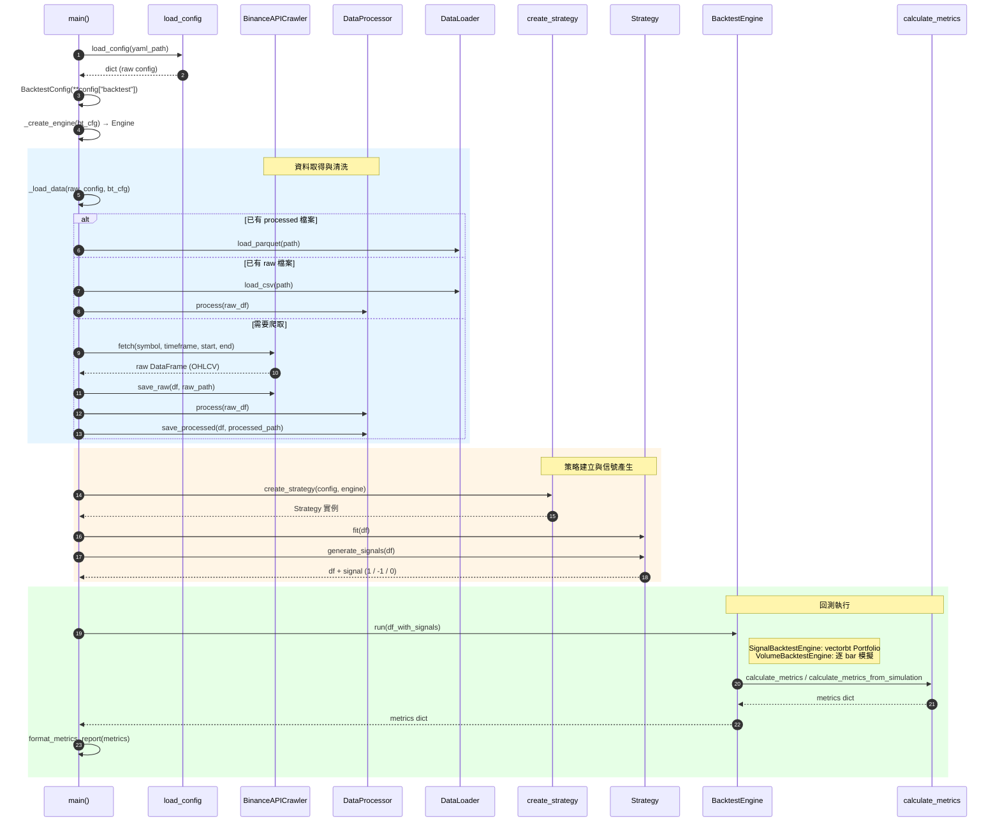
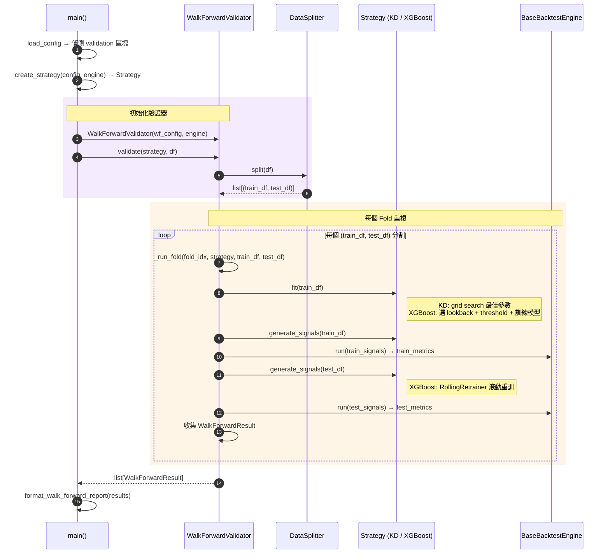
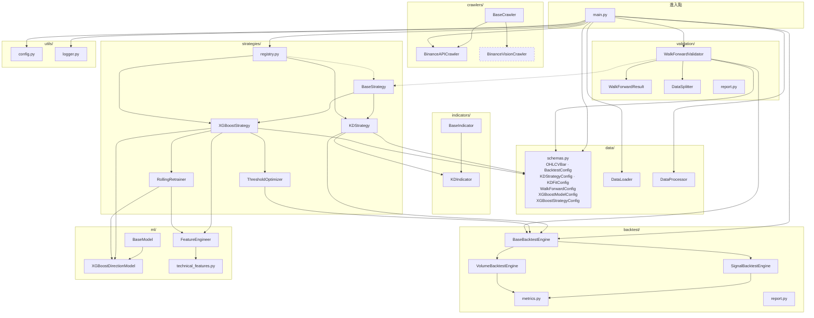

# Architecture Overview

## Class Diagram

```mermaid
classDiagram
    direction TB

    %% ──────────────── ABC 基底類別 ────────────────

    class BaseCrawler {
        <<abstract>>
        +fetch(symbol, timeframe, start, end) pd.DataFrame*
        +save_raw(df, output_path) None*
    }

    class BaseIndicator {
        <<abstract>>
        +calculate(df) pd.DataFrame*
        +get_parameters() dict*
    }

    class BaseStrategy {
        <<abstract>>
        +fit(df) None
        +generate_signals(df) pd.DataFrame*
        +get_parameters() dict*
    }

    class BaseModel {
        <<abstract>>
        +train(df, eval_df) None*
        +predict(df) pd.Series*
        +predict_proba(df) pd.DataFrame*
    }

    class BaseBacktestEngine {
        <<abstract>>
        -_init_cash: float
        -_fees: float
        -_slippage: float
        -_freq: str
        -_position_size_usdt: float | None
        -_stop_loss: float | None
        -_take_profit: float | None
        +run(df) dict*
    }

    %% ──────────────── Crawler 實作 ────────────────

    class BinanceAPICrawler {
        -_exchange: ccxt.binance
        +fetch(symbol, timeframe, start, end) pd.DataFrame
        +save_raw(df, output_path) None
    }

    class BinanceVisionCrawler {
        +fetch(symbol, timeframe, start, end) pd.DataFrame
        +save_raw(df, output_path) None
    }
    note for BinanceVisionCrawler "Skeleton — 尚未實作"

    BaseCrawler <|-- BinanceAPICrawler
    BaseCrawler <|-- BinanceVisionCrawler

    %% ──────────────── Indicator 實作 ────────────────

    class KDIndicator {
        -_k_period: int
        -_d_period: int
        -_smooth_k: int
        +calculate(df) pd.DataFrame
        +get_parameters() dict
    }

    BaseIndicator <|-- KDIndicator

    %% ──────────────── Strategy 實作 ────────────────

    class KDStrategy {
        -_config: KDStrategyConfig
        -_indicator: KDIndicator
        -_fit_config: KDFitConfig | None
        -_backtest_engine: BaseBacktestEngine | None
        +fit(df) None
        +generate_signals(df) pd.DataFrame
        +get_parameters() dict
    }

    class XGBoostStrategy {
        -_config: XGBoostStrategyConfig
        -_backtest_engine: BaseBacktestEngine | None
        -_model: XGBoostDirectionModel | None
        -_feature_engineer: FeatureEngineer | None
        -_best_lookback: int | None
        -_best_threshold: float | None
        -_train_data: pd.DataFrame | None
        +fit(df) None
        +generate_signals(df) pd.DataFrame
        +get_parameters() dict
        -_search_lookback(train_df, val_df) tuple
    }

    BaseStrategy <|-- KDStrategy
    BaseStrategy <|-- XGBoostStrategy
    KDStrategy *-- KDIndicator : 組合
    KDStrategy *-- KDStrategyConfig : 組合
    XGBoostStrategy *-- XGBoostStrategyConfig : 組合
    XGBoostStrategy *-- XGBoostDirectionModel : 組合
    XGBoostStrategy *-- FeatureEngineer : 組合
    XGBoostStrategy *-- RollingRetrainer : 使用
    XGBoostStrategy *-- ThresholdOptimizer : 使用

    %% ──────────────── Strategy 輔助類別 ────────────────

    class RollingRetrainer {
        -_model_config: XGBoostModelConfig
        -_retrain_interval: int
        -_threshold: float
        -_cooldown: int
        -_lookback: int
        +run(test_df, train_data, model, fe) ndarray
        -_retrain(combined, idx, window_size, fe, ...) XGBoostDirectionModel
        -_predict_bar(combined, idx, fe, model) int
    }

    class ThresholdOptimizer {
        -_engine: BaseBacktestEngine
        -_min_bars_between_trades: int
        +search(val_df, model, candidates, default, fe) float
    }

    %% ──────────────── ML 模組 ────────────────

    class XGBoostDirectionModel {
        -_config: XGBoostModelConfig
        -_model: XGBClassifier | None
        -_label_encoder: LabelEncoder
        -_feature_names: list
        +train(df, eval_df) None
        +predict(df) pd.Series
        +predict_proba(df) pd.DataFrame
        +get_parameters() dict
    }

    class FeatureEngineer {
        -_lookback: int
        -_target_horizon: int
        -_feature_names: list
        +transform(df, include_target) pd.DataFrame
        +get_feature_names() list
    }

    BaseModel <|-- XGBoostDirectionModel

    %% ──────────────── 回測引擎實作 ────────────────

    class SignalBacktestEngine {
        +run(df) dict
    }

    class VolumeBacktestEngine {
        +run(df) dict
    }

    BaseBacktestEngine <|-- SignalBacktestEngine
    BaseBacktestEngine <|-- VolumeBacktestEngine

    %% ──────────────── Validation 模組 ────────────────

    class WalkForwardValidator {
        -_config: WalkForwardConfig
        -_engine: BaseBacktestEngine
        -_splitter: DataSplitter
        +validate(strategy, df) list~WalkForwardResult~
        -_run_fold(fold_idx, strategy, train_df, test_df) WalkForwardResult
    }

    class DataSplitter {
        -_config: WalkForwardConfig
        +split(df) list
        -_explicit_split(df) list
        -_auto_split(df) list
    }

    class WalkForwardResult {
        <<dataclass>>
        +fold_index: int
        +train_start: datetime
        +train_end: datetime
        +test_start: datetime
        +test_end: datetime
        +train_metrics: dict
        +test_metrics: dict
        +strategy_params: dict
    }

    WalkForwardValidator *-- WalkForwardConfig : 組合
    WalkForwardValidator *-- BaseBacktestEngine : 組合
    WalkForwardValidator *-- DataSplitter : 組合
    WalkForwardValidator ..> WalkForwardResult : 產生
    WalkForwardValidator ..> BaseStrategy : 呼叫 fit/generate_signals

    %% ──────────────── Pydantic 資料模型 ────────────────

    class OHLCVBar {
        <<pydantic>>
        +timestamp: datetime
        +open: float
        +high: float
        +low: float
        +close: float
        +volume: float
    }

    class BacktestConfig {
        <<pydantic>>
        +symbol: str
        +timeframe: str
        +start_date: datetime
        +end_date: datetime
        +init_cash: float = 10000.0
        +fees: float = 0.0006
        +slippage: float = 0.0005
        +position_size_usdt: float | None
        +stop_loss: float | None
        +take_profit: float | None
        +mode: str = "signal"
    }

    class KDStrategyConfig {
        <<pydantic>>
        +k_period: int = 14
        +d_period: int = 3
        +smooth_k: int = 3
        +overbought: float = 80.0
        +oversold: float = 20.0
    }

    class KDFitConfig {
        <<pydantic>>
        +k_period_range: list~int~
        +d_period_range: list~int~
        +smooth_k_range: list~int~
        +overbought_range: list~float~
        +oversold_range: list~float~
        +target_metric: str = "sharpe_ratio"
    }

    class WalkForwardConfig {
        <<pydantic>>
        +train_start: datetime | None
        +train_end: datetime | None
        +test_start: datetime | None
        +test_end: datetime | None
        +n_splits: int = 1
        +train_ratio: float = 0.8
        +expanding: bool = False
        +target_metric: str = "sharpe_ratio"
    }

    class XGBoostModelConfig {
        <<pydantic>>
        +n_estimators: int = 100
        +max_depth: int = 6
        +learning_rate: float = 0.1
        +subsample: float = 0.8
        +colsample_bytree: float = 0.8
        +early_stopping_rounds: int = 10
        +random_state: int = 42
    }

    class XGBoostStrategyConfig {
        <<pydantic>>
        +model: XGBoostModelConfig
        +lookback_candidates: list~int~
        +retrain_interval: int = 24
        +validation_ratio: float = 0.2
        +signal_threshold: float = 0.55
        +signal_threshold_candidates: list~float~ | None
        +target_horizon: int = 1
        +min_bars_between_trades: int = 1
        +monthly_volume_target_usdt: float | None
    }

    %% ──────────────── 資料管線 ────────────────

    class DataLoader {
        +load_parquet(path) pd.DataFrame
        +load_csv(path) pd.DataFrame
    }

    class DataProcessor {
        +process(raw_df) pd.DataFrame
        +save_processed(df, output_path) None
    }

    %% ──────────────── 工具模組 ────────────────

    class config_mod ["utils/config"] {
        +load_config(path) dict
    }

    class logger_mod ["utils/logger"] {
        +setup_logger(name, level) Logger
    }

    class metrics_mod ["backtest/metrics"] {
        +calculate_metrics(pf) dict
        +calculate_metrics_from_simulation(equity, trades, init_cash, ts) dict
        +format_metrics_report(metrics) str
    }

    class report_mod ["validation/report"] {
        +summarize_results(results) dict
        +format_walk_forward_report(results) str
    }

    class tech_features_mod ["ml/technical_features"] {
        +compute_sma_ratios(close, windows) dict
        +compute_volume_features(volume, windows) dict
        +compute_ta_indicators(close) dict
    }

    class registry_mod ["strategies/registry"] {
        +create_strategy(raw_config, engine) BaseStrategy
    }

    SignalBacktestEngine ..> metrics_mod : 使用
    VolumeBacktestEngine ..> metrics_mod : 使用
    FeatureEngineer ..> tech_features_mod : 使用
```

## Pipeline Sequence Diagram

### 單次回測

```mermaid
sequenceDiagram
    autonumber
    participant Main as main()
    participant Cfg as load_config
    participant Crawler as BinanceAPICrawler
    participant Proc as DataProcessor
    participant Loader as DataLoader
    participant Reg as create_strategy
    participant Strat as Strategy
    participant Engine as BacktestEngine
    participant Metrics as calculate_metrics

    Main->>Cfg: load_config(yaml_path)
    Cfg-->>Main: dict (raw config)
    Main->>Main: BacktestConfig(**config["backtest"])
    Main->>Main: _create_engine(bt_cfg) → Engine

    rect rgb(230, 245, 255)
        Note over Crawler,Proc: 資料取得與清洗
        Main->>Main: _load_data(raw_config, bt_cfg)
        alt 已有 processed 檔案
            Main->>Loader: load_parquet(path)
        else 已有 raw 檔案
            Main->>Loader: load_csv(path)
            Main->>Proc: process(raw_df)
        else 需要爬取
            Main->>Crawler: fetch(symbol, timeframe, start, end)
            Crawler-->>Main: raw DataFrame (OHLCV)
            Main->>Crawler: save_raw(df, raw_path)
            Main->>Proc: process(raw_df)
            Main->>Proc: save_processed(df, processed_path)
        end
    end

    rect rgb(255, 245, 230)
        Note over Reg,Strat: 策略建立與信號產生
        Main->>Reg: create_strategy(config, engine)
        Reg-->>Main: Strategy 實例
        Main->>Strat: fit(df)
        Main->>Strat: generate_signals(df)
        Strat-->>Main: df + signal (1 / -1 / 0)
    end

    rect rgb(230, 255, 230)
        Note over Engine,Metrics: 回測執行
        Main->>Engine: run(df_with_signals)
        Note right of Engine: SignalBacktestEngine: vectorbt Portfolio<br/>VolumeBacktestEngine: 逐 bar 模擬
        Engine->>Metrics: calculate_metrics / calculate_metrics_from_simulation
        Metrics-->>Engine: metrics dict
        Engine-->>Main: metrics dict
        Main->>Main: format_metrics_report(metrics)
    end
```

### Walk-Forward 驗證流程

```mermaid
sequenceDiagram
    autonumber
    participant Main as main()
    participant WFV as WalkForwardValidator
    participant Splitter as DataSplitter
    participant Strat as Strategy (KD / XGBoost)
    participant Engine as BaseBacktestEngine

    Main->>Main: load_config → 偵測 validation 區塊
    Main->>Main: create_strategy(config, engine) → Strategy

    rect rgb(245, 235, 255)
        Note over Main,WFV: 初始化驗證器
        Main->>WFV: WalkForwardValidator(wf_config, engine)
        Main->>WFV: validate(strategy, df)
        WFV->>Splitter: split(df)
        Splitter-->>WFV: list[(train_df, test_df)]
    end

    rect rgb(255, 245, 230)
        Note over WFV,Engine: 每個 Fold 重複
        loop 每個 (train_df, test_df) 分割
            WFV->>WFV: _run_fold(fold_idx, strategy, train_df, test_df)
            WFV->>Strat: fit(train_df)
            Note right of Strat: KD: grid search 最佳參數<br/>XGBoost: 選 lookback + threshold + 訓練模型

            WFV->>Strat: generate_signals(train_df)
            WFV->>Engine: run(train_signals) → train_metrics

            WFV->>Strat: generate_signals(test_df)
            Note right of Strat: XGBoost: RollingRetrainer 滾動重訓
            WFV->>Engine: run(test_signals) → test_metrics

            WFV->>WFV: 收集 WalkForwardResult
        end
    end

    WFV-->>Main: list[WalkForwardResult]
    Main->>Main: format_walk_forward_report(results)
```

## Module Dependency Graph

```mermaid
graph TD
    subgraph Entry["進入點"]
        MAIN["main.py"]
    end

    subgraph Crawlers["crawlers/"]
        BC[BaseCrawler]
        BAC[BinanceAPICrawler]
        BVC[BinanceVisionCrawler]
        BC --> BAC
        BC --> BVC
    end

    subgraph Data["data/"]
        SCH["schemas.py<br/>OHLCVBar · BacktestConfig<br/>KDStrategyConfig · KDFitConfig<br/>WalkForwardConfig<br/>XGBoostModelConfig<br/>XGBoostStrategyConfig"]
        DL[DataLoader]
        DP[DataProcessor]
    end

    subgraph Indicators["indicators/"]
        BI[BaseIndicator]
        KDI[KDIndicator]
        BI --> KDI
    end

    subgraph Strategies["strategies/"]
        BS[BaseStrategy]
        KDS[KDStrategy]
        XGBS[XGBoostStrategy]
        REG[registry.py]
        RR[RollingRetrainer]
        TO[ThresholdOptimizer]
        BS --> KDS
        BS --> XGBS
    end

    subgraph Backtest["backtest/"]
        BBE[BaseBacktestEngine]
        SBE[SignalBacktestEngine]
        VBE[VolumeBacktestEngine]
        MT[metrics.py]
        RPT[report.py]
        BBE --> SBE
        BBE --> VBE
    end

    subgraph Validation["validation/"]
        WFV[WalkForwardValidator]
        WFR[WalkForwardResult]
        DS[DataSplitter]
        VRPT[report.py]
    end

    subgraph ML["ml/"]
        BM[BaseModel]
        XGBM[XGBoostDirectionModel]
        FE[FeatureEngineer]
        TF[technical_features.py]
        BM --> XGBM
    end

    subgraph Utils["utils/"]
        CFG[config.py]
        LOG[logger.py]
    end

    MAIN --> CFG
    MAIN --> LOG
    MAIN --> SCH
    MAIN --> BAC
    MAIN --> DL
    MAIN --> DP
    MAIN --> REG
    MAIN --> BBE
    MAIN --> WFV

    REG --> KDS
    REG --> XGBS
    REG -.-> BS

    KDS --> KDI
    KDS --> SCH
    KDS --> BBE

    XGBS --> XGBM
    XGBS --> FE
    XGBS --> SCH
    XGBS --> RR
    XGBS --> TO

    RR --> XGBM
    RR --> FE
    TO --> BBE

    FE --> TF

    WFV --> BBE
    WFV --> SCH
    WFV --> WFR
    WFV --> DS
    WFV -.-> BS

    SBE --> MT
    VBE --> MT

    style BVC stroke-dasharray: 5 5
```
