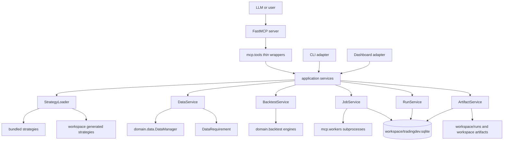
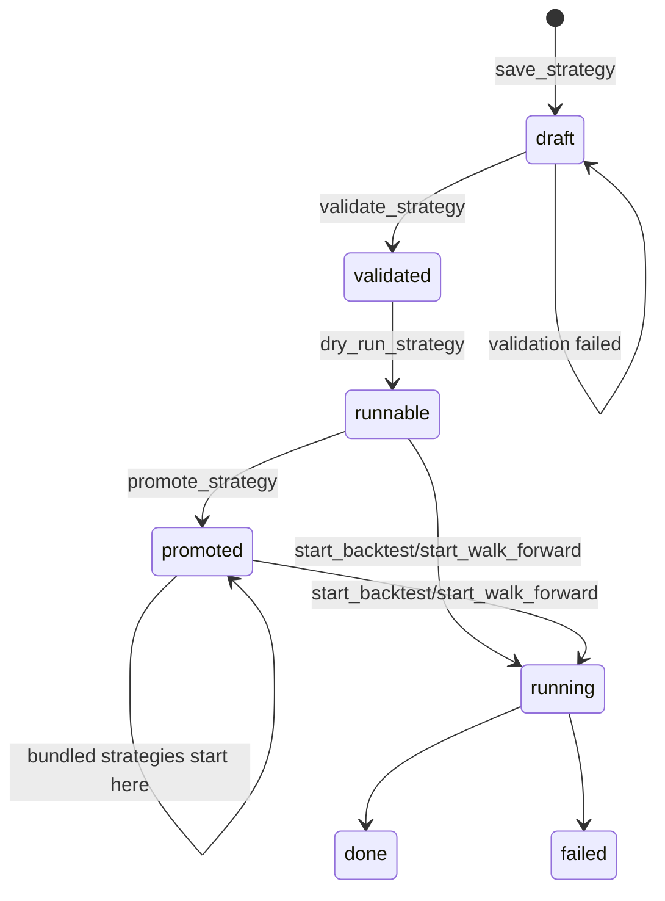
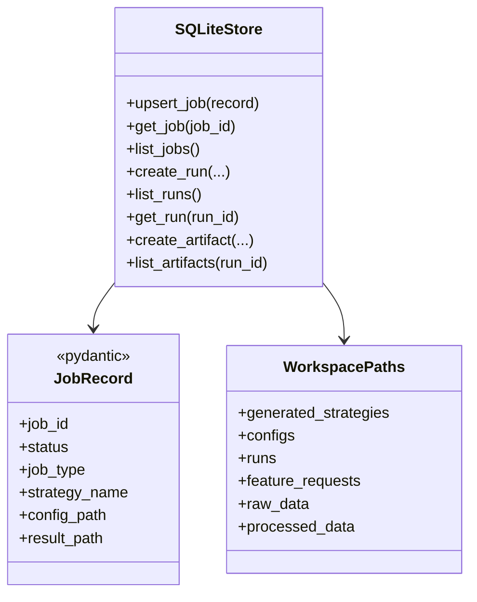

# Architecture Overview

TradingDev 的主要產品邊界是 MCP tools。MCP、CLI 與 dashboard 不各自組回測流程，
而是呼叫 `tradingdev.app` services；domain 層保存交易、資料、策略與模型邏輯；
adapters 層負責 FastMCP、CLI、dashboard、SQLite、filesystem 與 subprocess。

## Module Layout

```text
src/tradingdev/
  mcp/
    server.py
    schemas.py
    tools/
    workers/
  app/
    strategy_service.py
    data_service.py
    backtest_service.py
    optimization_service.py
    job_service.py
    run_service.py
    artifact_service.py
    feature_request_service.py
    capability_service.py
    job_store.py
  domain/
    strategies/
    backtest/
    data/
    indicators/
    ml/
    validation/
  adapters/
    cli/
    dashboard/
    execution/
    storage/
  shared/
    utils/
```

## Runtime Flow



## Strategy Lifecycle



Generated strategies must live in `workspace/generated_strategies/`. Bundled
strategies live next to their git-versioned configs under
`src/tradingdev/domain/strategies/bundled/`.

## Storage



SQLite stores metadata. Filesystem stores generated code/config, result JSON,
feature requests and data caches. `workspace/runs/<run_id>/` is linked from the
`runs.artifact_dir` column.

## Domain Contracts

- Strategy signal convention: `1` long, `-1` short, `0` flat.
- Strategy parameters live in YAML `strategy.parameters`.
- Data requirements live in YAML `data.requirements`.
- `start_backtest` rejects configs with `validation:`; use `start_walk_forward`.
- Generated strategies must pass static policy checks before execution.
- Runtime cache defaults to `workspace/data/`; `TRADINGDEV_DATA_ROOT` can override
  raw/processed data root.
