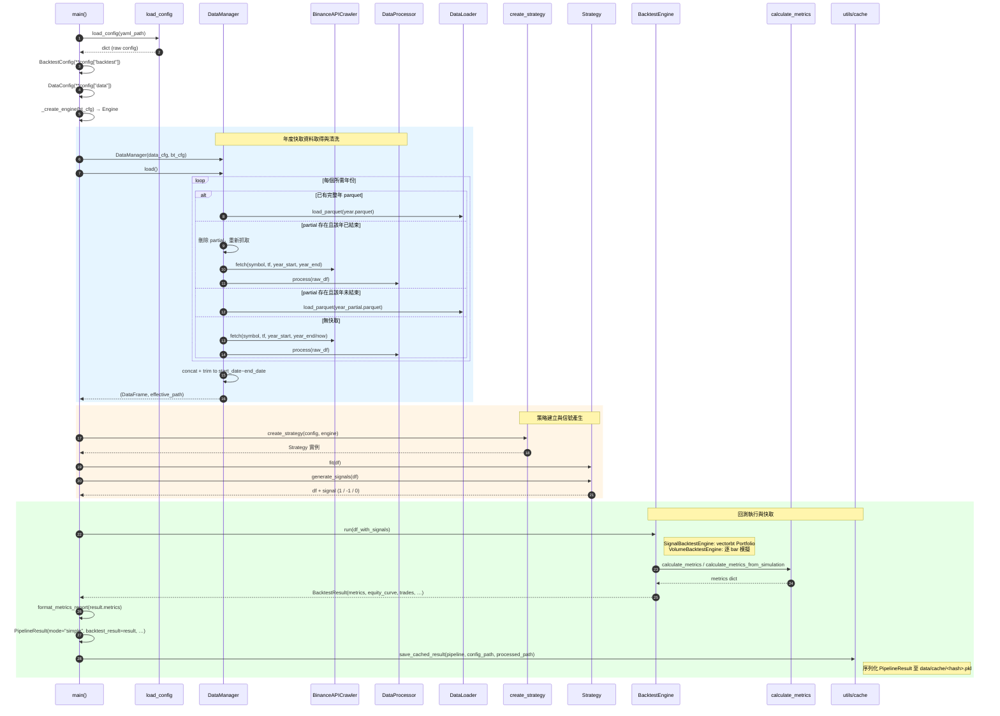
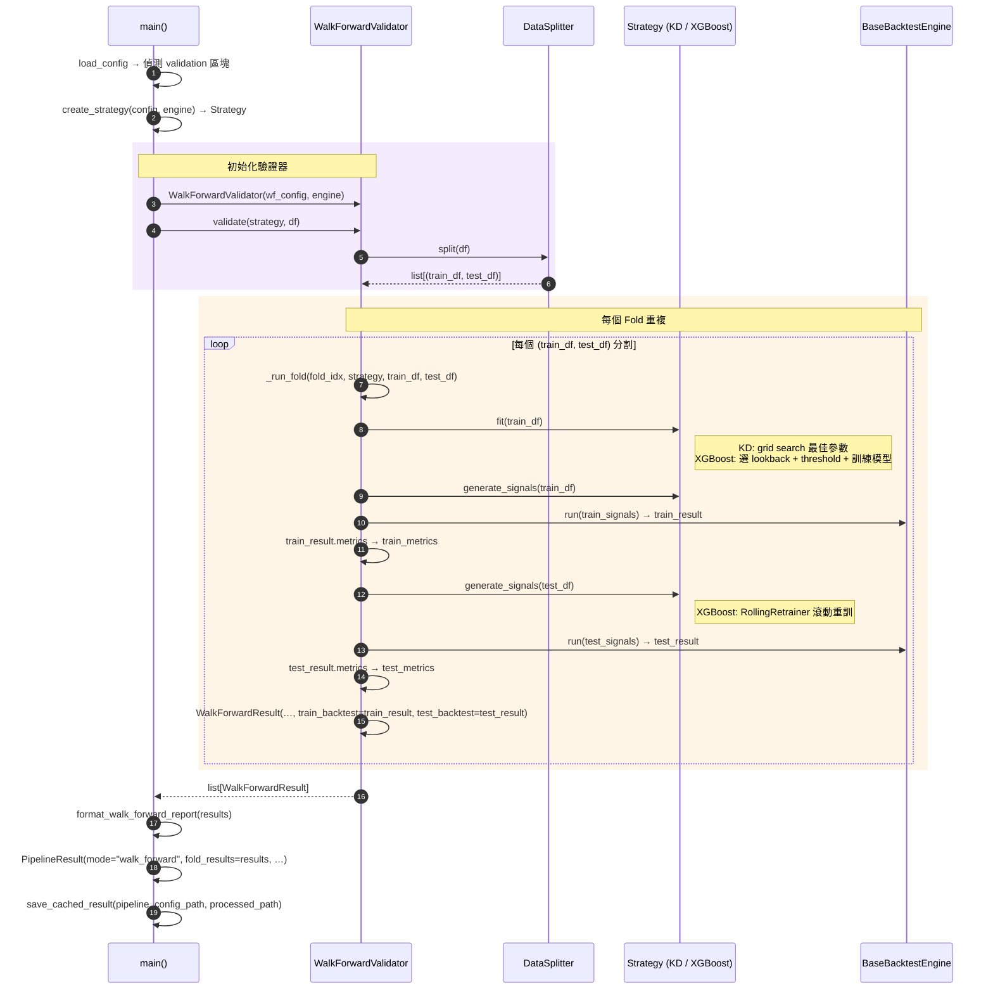
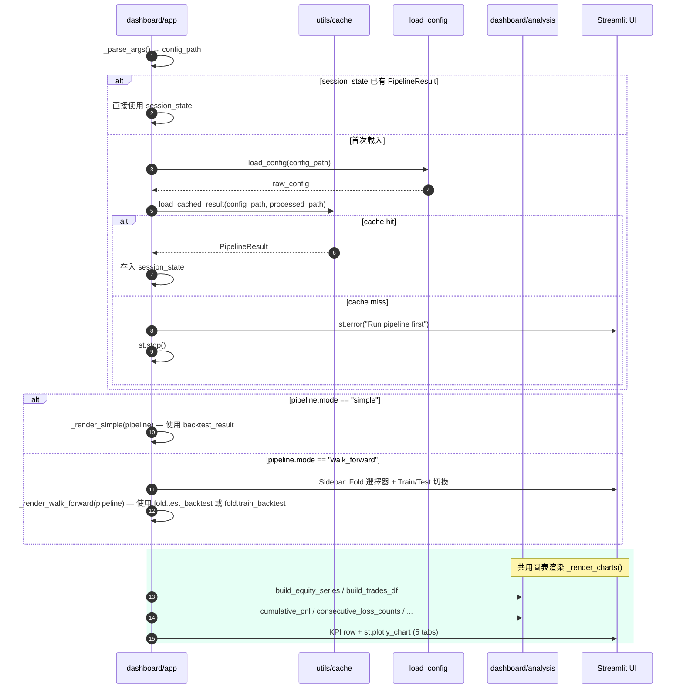

# Architecture Overview

## Class Diagram

```mermaid
classDiagram
    direction TB

    %% ──────────────── ABC 基底類別 ────────────────

    class BaseCrawler {
        <<abstract>>
        +fetch(symbol, timeframe, start, end) pd.DataFrame*
        +save_raw(df, output_path) None*
    }

    class BaseIndicator {
        <<abstract>>
        +calculate(df) pd.DataFrame*
        +get_parameters() dict*
    }

    class BaseStrategy {
        <<abstract>>
        +fit(df) None
        +generate_signals(df) pd.DataFrame*
        +get_parameters() dict*
    }

    class BaseModel {
        <<abstract>>
        +train(df, eval_df) None*
        +predict(df) pd.Series*
        +predict_proba(df) pd.DataFrame*
    }

    class BaseBacktestEngine {
        <<abstract>>
        -_init_cash: float
        -_fees: float
        -_slippage: float
        -_freq: str
        -_position_size: float | None
        -_stop_loss: float | None
        -_take_profit: float | None
        +run(df) BacktestResult*
    }

    %% ──────────────── Crawler 實作 ────────────────

    class BinanceAPICrawler {
        -_exchange: ccxt.binance
        +fetch(symbol, timeframe, start, end) pd.DataFrame
        +save_raw(df, output_path) None
    }

    class BinanceVisionCrawler {
        +fetch(symbol, timeframe, start, end) pd.DataFrame
        +save_raw(df, output_path) None
    }
    note for BinanceVisionCrawler "Skeleton — 尚未實作"

    class DeribitDVOLCrawler {
        -_client: httpx.Client
        +fetch(symbol, timeframe, start, end) pd.DataFrame
        +save_raw(df, output_path) None
    }
    note for DeribitDVOLCrawler "Deribit DVOL 隱含波動度指數"

    BaseCrawler <|-- BinanceAPICrawler
    BaseCrawler <|-- BinanceVisionCrawler
    BaseCrawler <|-- DeribitDVOLCrawler

    %% ──────────────── Indicator 實作 ────────────────

    class KDIndicator {
        -_k_period: int
        -_d_period: int
        -_smooth_k: int
        +calculate(df) pd.DataFrame
        +get_parameters() dict
    }

    BaseIndicator <|-- KDIndicator

    %% ──────────────── Strategy 實作 ────────────────

    class KDStrategy {
        -_config: KDStrategyConfig
        -_indicator: KDIndicator
        -_fit_config: KDFitConfig | None
        -_backtest_engine: BaseBacktestEngine | None
        +fit(df) None
        +generate_signals(df) pd.DataFrame
        +get_parameters() dict
    }

    class XGBoostStrategy {
        -_config: XGBoostStrategyConfig
        -_backtest_engine: BaseBacktestEngine | None
        -_model: XGBoostDirectionModel | None
        -_feature_engineer: FeatureEngineer | None
        -_best_lookback: int | None
        -_best_threshold: float | None
        -_train_data: pd.DataFrame | None
        +fit(df) None
        +generate_signals(df) pd.DataFrame
        +get_parameters() dict
        -_search_lookback(train_df, val_df) tuple
    }

    class SafetyVolumeStrategy {
        -_config: SafetyVolumeStrategyConfig
        -_backtest_engine: BaseBacktestEngine | None
        -_risk_model: XGBoostDirectionModel | None
        -_risk_fe: RiskFeatureEngineer | None
        -_best_lookback: int | None
        -_best_threshold: float
        -_train_data: pd.DataFrame | None
        +fit(df) None
        +generate_signals(df) pd.DataFrame
        +get_parameters() dict
        -_search_lookback(train_df, val_df) tuple
        -_search_threshold(val_df, model, fe, lookback) float
        -_predict_risk_rolling(df) ndarray
        -_compute_directions(df) ndarray
        -_run_state_machine(risk, dirs) ndarray
    }

    class GLFTStrategy {
        -_config: GLFTStrategyConfig
        -_backtest_engine: BaseBacktestEngine | None
        -_best_gamma: float
        -_best_kappa: float
        -_best_ema_window: int
        +fit(df) None
        +generate_signals(df) pd.DataFrame
        +get_parameters() dict
        -_compute_volatility(close, high, low, dvol?) ndarray
        -_run_glft_state_machine(close, ema, sigma, ...) ndarray
    }

    class GLFTMLStrategy {
        -_config: GLFTMLStrategyConfig
        -_backtest_engine: BaseBacktestEngine | None
        -_ml_model: AutoGluonDirectionModel | None
        -_feature_engineer: DirectionFeatureEngineer | None
        +fit(df) None
        +generate_signals(df) pd.DataFrame
        +get_parameters() dict
        -_grid_search_glft(feat_df, ml_directions) None
        -_run_ml_glft_state_machine(close, ema, sigma, ...) ndarray
    }

    BaseStrategy <|-- KDStrategy
    BaseStrategy <|-- XGBoostStrategy
    BaseStrategy <|-- SafetyVolumeStrategy
    BaseStrategy <|-- GLFTStrategy
    BaseStrategy <|-- GLFTMLStrategy
    KDStrategy *-- KDIndicator : 組合
    KDStrategy *-- KDStrategyConfig : 組合
    XGBoostStrategy *-- XGBoostStrategyConfig : 組合
    XGBoostStrategy *-- XGBoostDirectionModel : 組合
    XGBoostStrategy *-- FeatureEngineer : 組合
    XGBoostStrategy *-- RollingRetrainer : 使用
    XGBoostStrategy *-- ThresholdOptimizer : 使用
    SafetyVolumeStrategy *-- SafetyVolumeStrategyConfig : 組合
    SafetyVolumeStrategy *-- XGBoostDirectionModel : 組合
    SafetyVolumeStrategy *-- RiskFeatureEngineer : 組合
    GLFTStrategy *-- GLFTStrategyConfig : 組合
    GLFTMLStrategy *-- GLFTMLStrategyConfig : 組合
    GLFTMLStrategy *-- AutoGluonDirectionModel : 組合
    GLFTMLStrategy *-- DirectionFeatureEngineer : 組合

    %% ──────────────── Strategy 輔助類別 ────────────────

    class RollingRetrainer {
        -_model_config: XGBoostModelConfig
        -_retrain_interval: int
        -_threshold: float
        -_cooldown: int
        -_lookback: int
        +run(test_df, train_data, model, fe) ndarray
        -_retrain(combined, idx, window_size, fe, ...) XGBoostDirectionModel
        -_predict_bar(combined, idx, fe, model) int
    }

    class ThresholdOptimizer {
        -_engine: BaseBacktestEngine
        -_min_bars_between_trades: int
        +search(val_df, model, candidates, default, fe) float
    }

    %% ──────────────── ML 模組 ────────────────

    class XGBoostDirectionModel {
        -_config: XGBoostModelConfig
        -_model: XGBClassifier | None
        -_label_encoder: LabelEncoder
        -_feature_names: list
        +train(df, eval_df) None
        +predict(df) pd.Series
        +predict_proba(df) pd.DataFrame
        +get_parameters() dict
    }

    class FeatureEngineer {
        -_lookback: int
        -_target_horizon: int
        -_feature_names: list
        +transform(df, include_target) pd.DataFrame
        +get_feature_names() list
    }

    class RiskFeatureEngineer {
        -_lookback: int
        -_target_holding_bars: int
        -_fee_rate: float
        -_max_loss_pct: float
        -_feature_names: list
        +transform(df, include_target) pd.DataFrame
        +get_feature_names() list
        -_compute_safe_target(df) pd.Series
    }

    class AutoGluonDirectionModel {
        -_time_limit: int
        -_presets: str
        -_eval_metric: str
        -_predictor: TabularPredictor | None
        -_feature_names: list
        -_model_path: Path | None
        +train(df, eval_df) None
        +predict(df) pd.Series
        +predict_proba(df) pd.DataFrame
        +cleanup() None
        +get_parameters() dict
    }

    class DirectionFeatureEngineer {
        -_lookback: int
        -_prediction_horizon: int
        -_feature_names: list
        +transform(df, include_target) pd.DataFrame
        +get_feature_names() list
    }

    BaseModel <|-- XGBoostDirectionModel
    BaseModel <|-- AutoGluonDirectionModel

    %% ──────────────── 回測引擎實作 ────────────────

    class BacktestResult {
        <<dataclass>>
        +metrics: dict
        +equity_curve: ndarray
        +trades: list~dict~
        +timestamps: ndarray | None
        +init_cash: float = 10000.0
        +mode: str = "signal"
    }

    class SignalBacktestEngine {
        +run(df) BacktestResult
    }

    class VolumeBacktestEngine {
        +run(df) BacktestResult
    }

    BaseBacktestEngine <|-- SignalBacktestEngine
    BaseBacktestEngine <|-- VolumeBacktestEngine
    SignalBacktestEngine ..> BacktestResult : 產生
    VolumeBacktestEngine ..> BacktestResult : 產生

    %% ──────────────── Validation 模組 ────────────────

    class WalkForwardValidator {
        -_config: WalkForwardConfig
        -_engine: BaseBacktestEngine
        -_splitter: DataSplitter
        +validate(strategy, df) list~WalkForwardResult~
        -_run_fold(fold_idx, strategy, train_df, test_df) WalkForwardResult
    }

    class DataSplitter {
        -_config: WalkForwardConfig
        +split(df) list
        -_explicit_split(df) list
        -_auto_split(df) list
    }

    class WalkForwardResult {
        <<dataclass>>
        +fold_index: int
        +train_start: datetime
        +train_end: datetime
        +test_start: datetime
        +test_end: datetime
        +train_metrics: dict
        +test_metrics: dict
        +strategy_params: dict
        +train_backtest: BacktestResult | None
        +test_backtest: BacktestResult | None
    }

    class PipelineResult {
        <<dataclass>>
        +mode: str
        +backtest_result: BacktestResult | None
        +fold_results: list~WalkForwardResult~
        +config_snapshot: dict
    }

    WalkForwardValidator *-- WalkForwardConfig : 組合
    WalkForwardValidator *-- BaseBacktestEngine : 組合
    WalkForwardValidator *-- DataSplitter : 組合
    WalkForwardValidator ..> WalkForwardResult : 產生
    WalkForwardValidator ..> BaseStrategy : 呼叫 fit/generate_signals
    WalkForwardResult o-- BacktestResult : train/test backtest

    PipelineResult o-- BacktestResult : simple mode
    PipelineResult o-- WalkForwardResult : walk-forward mode

    %% ──────────────── Pydantic 資料模型 ────────────────

    class DVOLBar {
        <<pydantic>>
        +timestamp: datetime
        +dvol_open: float
        +dvol_high: float
        +dvol_low: float
        +dvol_close: float
    }

    class OHLCVBar {
        <<pydantic>>
        +timestamp: datetime
        +open: float
        +high: float
        +low: float
        +close: float
        +volume: float
    }

    class BacktestConfig {
        <<pydantic>>
        +symbol: str
        +timeframe: str
        +start_date: datetime
        +end_date: datetime
        +init_cash: float = 10000.0
        +fees: float = 0.0006
        +slippage: float = 0.0005
        +position_size: float | None
        +stop_loss: float | None
        +take_profit: float | None
        +signal_as_position: bool = False
        +re_entry_after_sl: bool = True
        +mode: str = "signal"
    }

    class KDStrategyConfig {
        <<pydantic>>
        +k_period: int = 14
        +d_period: int = 3
        +smooth_k: int = 3
        +overbought: float = 80.0
        +oversold: float = 20.0
    }

    class KDFitConfig {
        <<pydantic>>
        +k_period_range: list~int~
        +d_period_range: list~int~
        +smooth_k_range: list~int~
        +overbought_range: list~float~
        +oversold_range: list~float~
        +target_metric: str = "sharpe_ratio"
    }

    class WalkForwardConfig {
        <<pydantic>>
        +train_start: datetime | None
        +train_end: datetime | None
        +test_start: datetime | None
        +test_end: datetime | None
        +n_splits: int = 1
        +train_ratio: float = 0.8
        +expanding: bool = False
        +target_metric: str = "sharpe_ratio"
    }

    class XGBoostModelConfig {
        <<pydantic>>
        +n_estimators: int = 100
        +max_depth: int = 6
        +learning_rate: float = 0.1
        +subsample: float = 0.8
        +colsample_bytree: float = 0.8
        +early_stopping_rounds: int = 10
        +random_state: int = 42
    }

    class XGBoostStrategyConfig {
        <<pydantic>>
        +model: XGBoostModelConfig
        +lookback_candidates: list~int~
        +retrain_interval: int = 24
        +validation_ratio: float = 0.2
        +signal_threshold: float = 0.55
        +signal_threshold_candidates: list~float~ | None
        +target_horizon: int = 1
        +min_bars_between_trades: int = 1
        +monthly_volume_target: float | None
    }

    class SafetyVolumeStrategyConfig {
        <<pydantic>>
        +risk_model: XGBoostModelConfig
        +risk_threshold: float = 0.5
        +risk_threshold_candidates: list~float~ | None
        +target_holding_bars: int = 5
        +max_acceptable_loss_pct: float = 0.003
        +fee_rate: float = 0.0011
        +use_ml_direction: bool = False
        +sma_fast: int = 5
        +sma_slow: int = 20
        +min_holding_bars: int = 5
        +max_holding_bars: int = 30
        +lookback_candidates: list~int~
        +retrain_interval: int = 720
        +validation_ratio: float = 0.2
        +position_size: float = 3000.0
        +monthly_volume_target: float | None
    }

    class GLFTStrategyConfig {
        <<pydantic>>
        +gamma: float = 500.0
        +kappa: float = 1000.0
        +ema_window: int = 21
        +vol_window: int = 30
        +vol_type: str = "realized"
        +dvol_raw_path: str | None
        +dvol_processed_path: str | None
        +min_holding_bars: int = 5
        +max_holding_bars: int = 30
        +min_entry_edge: float = 0.0012
        +profit_target_ratio: float = 1.0
        +strategy_sl: float = 0.005
        +momentum_guard: bool = True
        +signal_agg_minutes: int = 1
        +gamma_candidates: list~float~
        +kappa_candidates: list~float~
        +ema_window_candidates: list~int~
        +target_metric: str = "total_return"
        +position_size: float = 3000.0
        +monthly_volume_target: float | None
        +fee_rate: float = 0.0006
        +min_annual_return: float | None
    }

    class GLFTMLStrategyConfig {
        <<pydantic>>
        +prediction_horizon: int = 5
        +feature_lookback: int = 60
        +ml_time_limit: int = 300
        +ml_presets: str = "medium_quality"
        +confidence_threshold: float = 0.55
        +gamma: float = 0.0
        +kappa: float = 1000.0
        +ema_window: int = 15
        +vol_type: str = "implied"
        +min_entry_edge: float = 0.0012
        +profit_target_ratio: float = 0.75
        +strategy_sl: float = 0.003
        +fee_rate: float = 0.0002
    }

    %% ──────────────── 資料管線 ────────────────

    class DataConfig {
        <<pydantic>>
        +source: str = "binance_api"
        +raw_dir: str = "data/raw"
        +processed_dir: str = "data/processed"
    }

    class DataManager {
        -_data_cfg: DataConfig
        -_bt_cfg: BacktestConfig
        -_now_fn: Callable
        -_crawler: BinanceAPICrawler
        -_loader: DataLoader
        -_processor: DataProcessor
        +load() tuple~DataFrame, Path~
        +effective_processed_path: Path
        -_ensure_year_cached(year) DataFrame
        -_fetch_and_cache_year(year, complete) DataFrame
        -_trim_to_range(df) DataFrame
        -_raw_path_for_year(year, partial) Path
        -_processed_path_for_year(year, partial) Path
    }

    DataManager *-- DataConfig : 組合
    DataManager *-- BacktestConfig : 組合
    DataManager *-- BinanceAPICrawler : 組合
    DataManager *-- DataLoader : 組合
    DataManager *-- DataProcessor : 組合

    class DataLoader {
        +load_parquet(path) pd.DataFrame
        +load_csv(path) pd.DataFrame
    }

    class DataProcessor {
        +process(raw_df) pd.DataFrame
        +save_processed(df, output_path) None
    }

    %% ──────────────── 工具模組 ────────────────

    class config_mod ["utils/config"] {
        +load_config(path) dict
    }

    class logger_mod ["utils/logger"] {
        +setup_logger(name, level) Logger
    }

    class metrics_mod ["backtest/metrics"] {
        +calculate_metrics(pf) dict
        +calculate_metrics_from_simulation(equity, trades, init_cash, ts) dict
        +format_metrics_report(metrics) str
    }

    class report_mod ["validation/report"] {
        +summarize_results(results) dict
        +format_walk_forward_report(results) str
    }

    class tech_features_mod ["ml/technical_features"] {
        +compute_sma_ratios(close, windows) dict
        +compute_volume_features(volume, windows) dict
        +compute_ta_indicators(close) dict
    }

    class registry_mod ["strategies/registry"] {
        +create_strategy(raw_config, engine) BaseStrategy
    }

    class cache_mod ["utils/cache"] {
        +compute_cache_key(config_path, processed_path) str
        +load_cached_result(config_path, processed_path) PipelineResult | None
        +save_cached_result(result, config_path, processed_path) Path
        +clear_cache() int
    }

    %% ──────────────── Dashboard 模組 ────────────────

    class analysis_mod ["dashboard/analysis"] {
        +build_equity_series(equity_curve, timestamps) Series
        +build_trades_df(trades, timestamps) DataFrame
        +cumulative_pnl(equity, init_cash) Series
        +cumulative_pnl_pct(equity, init_cash) Series
        +consecutive_loss_counts(trades_df) Series
        +rolling_mdd_absolute(equity, window_bars) Series
        +monthly_volume(trades_df) DataFrame
        +filter_by_month(equity, trades_df, month) tuple
        +available_months(timestamps) list
    }

    class dashboard_app ["dashboard/app"] {
        +main() None
    }

    dashboard_app ..> analysis_mod : 使用
    dashboard_app ..> cache_mod : 讀取 cache
    dashboard_app ..> PipelineResult : 載入
    dashboard_app ..> BacktestResult : 顯示

    SignalBacktestEngine ..> metrics_mod : 使用
    VolumeBacktestEngine ..> metrics_mod : 使用
    FeatureEngineer ..> tech_features_mod : 使用
    cache_mod ..> PipelineResult : 序列化
```

## Pipeline Sequence Diagram

### 單次回測



### Walk-Forward 驗證流程



### Dashboard 啟動流程（Viewer-Only）



## Module Dependency Graph

```mermaid
graph TD
    subgraph Entry["進入點"]
        MAIN["main.py"]
        DASH["dashboard/app.py"]
    end

    subgraph Crawlers["crawlers/"]
        BC[BaseCrawler]
        BAC[BinanceAPICrawler]
        BVC[BinanceVisionCrawler]
        DDC[DeribitDVOLCrawler]
        BC --> BAC
        BC --> BVC
        BC --> DDC
    end

    subgraph Data["data/"]
        SCH["schemas.py<br/>DVOLBar · OHLCVBar · DataConfig · BacktestConfig<br/>KDStrategyConfig · KDFitConfig<br/>WalkForwardConfig<br/>XGBoostModelConfig · XGBoostStrategyConfig<br/>SafetyVolumeStrategyConfig<br/>GLFTStrategyConfig · GLFTMLStrategyConfig"]
        DM[DataManager]
        DL[DataLoader]
        DP[DataProcessor]
        DM --> DL
        DM --> DP
    end

    subgraph Indicators["indicators/"]
        BI[BaseIndicator]
        KDI[KDIndicator]
        BI --> KDI
    end

    subgraph Strategies["strategies/"]
        BS[BaseStrategy]
        KDS[KDStrategy]
        XGBS[XGBoostStrategy]
        SFVS[SafetyVolumeStrategy]
        GLFTS[GLFTStrategy]
        GLFTMLS[GLFTMLStrategy]
        REG[registry.py]
        RR[RollingRetrainer]
        TO[ThresholdOptimizer]
        BS --> KDS
        BS --> XGBS
        BS --> SFVS
        BS --> GLFTS
        BS --> GLFTMLS
    end

    subgraph Backtest["backtest/"]
        BBE[BaseBacktestEngine]
        SBE[SignalBacktestEngine]
        VBE[VolumeBacktestEngine]
        BR[BacktestResult]
        PR[PipelineResult]
        MT[metrics.py]
        RPT[report.py]
        BBE --> SBE
        BBE --> VBE
    end

    subgraph Dashboard["dashboard/"]
        DAPP[app.py]
        DANA[analysis.py]
    end

    subgraph Validation["validation/"]
        WFV[WalkForwardValidator]
        WFR[WalkForwardResult]
        DS[DataSplitter]
        VRPT[report.py]
    end

    subgraph ML["ml/"]
        BM[BaseModel]
        XGBM[XGBoostDirectionModel]
        AGM[AutoGluonDirectionModel]
        FE[FeatureEngineer]
        RFE[RiskFeatureEngineer]
        DFE[DirectionFeatureEngineer]
        TF[technical_features.py]
        BM --> XGBM
        BM --> AGM
    end

    subgraph Utils["utils/"]
        CFG[config.py]
        LOG[logger.py]
        CACHE[cache.py]
        PAR[parallel.py]
    end

    MAIN --> CFG
    MAIN --> LOG
    MAIN --> CACHE
    MAIN --> SCH
    MAIN --> DM
    MAIN -.-> DDC
    MAIN --> DL
    MAIN --> REG
    MAIN --> BBE
    MAIN --> WFV
    MAIN --> PR
    DM --> BAC

    DASH --> DAPP
    DAPP --> DANA
    DAPP --> CACHE
    DAPP --> CFG
    DAPP --> SCH
    DAPP --> DM
    DAPP --> PR
    DAPP --> BR

    REG --> KDS
    REG --> XGBS
    REG --> SFVS
    REG --> GLFTS
    REG --> GLFTMLS
    REG -.-> BS

    KDS --> KDI
    KDS --> SCH
    KDS --> BBE
    KDS --> PAR

    XGBS --> XGBM
    XGBS --> FE
    XGBS --> SCH
    XGBS --> RR
    XGBS --> TO

    RR --> XGBM
    RR --> FE
    TO --> BBE

    SFVS --> XGBM
    SFVS --> RFE
    SFVS --> SCH

    GLFTS --> SCH
    GLFTS --> BBE
    GLFTS --> PAR

    GLFTMLS --> AGM
    GLFTMLS --> DFE
    GLFTMLS --> SCH
    GLFTMLS --> BBE
    GLFTMLS --> PAR

    FE --> TF
    RFE --> TF

    WFV --> BBE
    WFV --> SCH
    WFV --> WFR
    WFV --> DS
    WFV -.-> BS

    SBE --> MT
    SBE --> BR
    VBE --> MT
    VBE --> BR
    CACHE --> PR

    style BVC stroke-dasharray: 5 5
```


