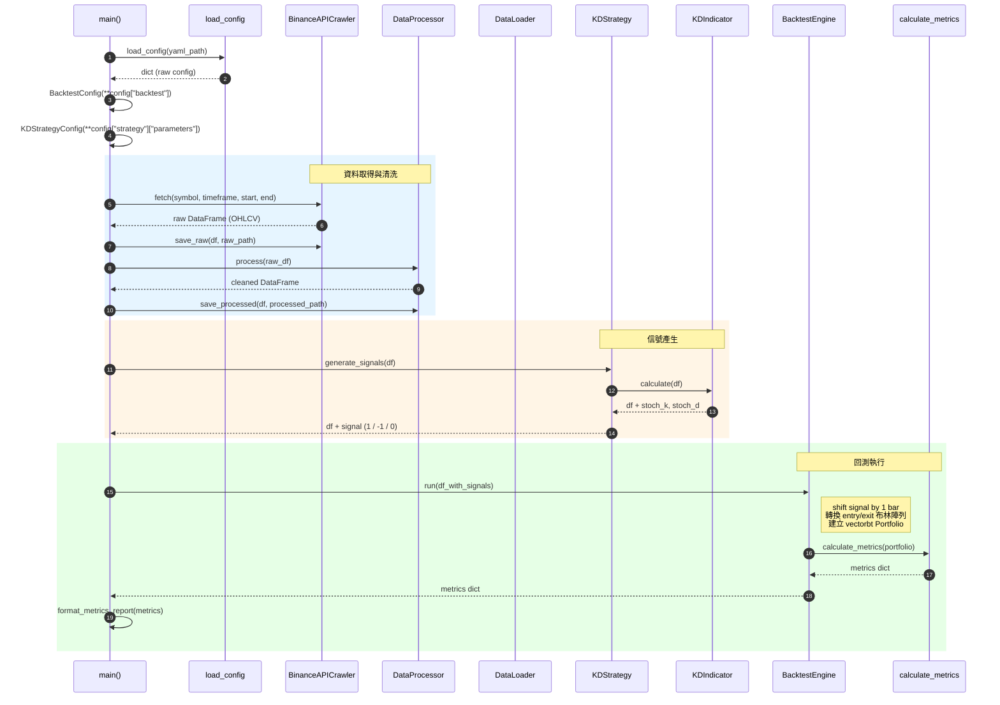
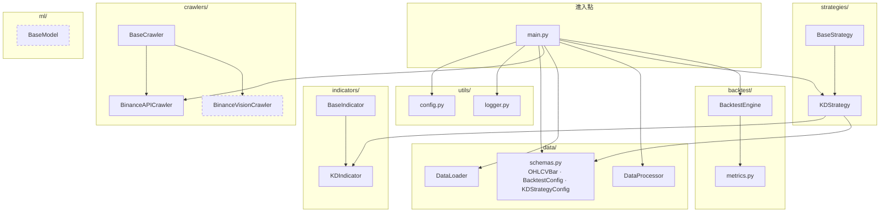

# Architecture Overview

## Class Diagram

```mermaid
classDiagram
    direction TB

    %% ──────────────── ABC 基底類別 ────────────────

    class BaseCrawler {
        <<abstract>>
        +fetch(symbol, timeframe, start, end) pd.DataFrame*
        +save_raw(df, output_path) None*
    }

    class BaseIndicator {
        <<abstract>>
        +calculate(df) pd.DataFrame*
        +get_parameters() dict*
    }

    class BaseStrategy {
        <<abstract>>
        +generate_signals(df) pd.DataFrame*
        +get_parameters() dict*
    }

    class BaseModel {
        <<abstract>>
        +train(df) None*
        +predict(df) pd.Series*
    }

    %% ──────────────── Crawler 實作 ────────────────

    class BinanceAPICrawler {
        -_exchange: ccxt.binance
        +fetch(symbol, timeframe, start, end) pd.DataFrame
        +save_raw(df, output_path) None
    }

    class BinanceVisionCrawler {
        +fetch(symbol, timeframe, start, end) pd.DataFrame
        +save_raw(df, output_path) None
    }
    note for BinanceVisionCrawler "Skeleton — 尚未實作"

    BaseCrawler <|-- BinanceAPICrawler
    BaseCrawler <|-- BinanceVisionCrawler

    %% ──────────────── Indicator 實作 ────────────────

    class KDIndicator {
        -_k_period: int
        -_d_period: int
        -_smooth_k: int
        +calculate(df) pd.DataFrame
        +get_parameters() dict
    }

    BaseIndicator <|-- KDIndicator

    %% ──────────────── Strategy 實作 ────────────────

    class KDStrategy {
        -_config: KDStrategyConfig
        -_indicator: KDIndicator
        +generate_signals(df) pd.DataFrame
        +get_parameters() dict
    }

    BaseStrategy <|-- KDStrategy
    KDStrategy *-- KDIndicator : 組合
    KDStrategy *-- KDStrategyConfig : 組合

    %% ──────────────── Pydantic 資料模型 ────────────────

    class OHLCVBar {
        <<pydantic>>
        +timestamp: datetime
        +open: float
        +high: float
        +low: float
        +close: float
        +volume: float
    }

    class BacktestConfig {
        <<pydantic>>
        +symbol: str
        +timeframe: str
        +start_date: datetime
        +end_date: datetime
        +init_cash: float = 10000.0
        +fees: float = 0.0006
        +slippage: float = 0.0005
    }

    class KDStrategyConfig {
        <<pydantic>>
        +k_period: int = 14
        +d_period: int = 3
        +smooth_k: int = 3
        +overbought: float = 80.0
        +oversold: float = 20.0
    }

    %% ──────────────── 資料管線 ────────────────

    class DataLoader {
        +load_parquet(path) pd.DataFrame
        +load_csv(path) pd.DataFrame
    }

    class DataProcessor {
        +process(raw_df) pd.DataFrame
        +save_processed(df, output_path) None
    }

    %% ──────────────── 回測引擎 ────────────────

    class BacktestEngine {
        -_init_cash: float
        -_fees: float
        -_slippage: float
        -_freq: str
        +run(df) dict
    }

    %% ──────────────── 工具模組 ────────────────

    class config_mod ["utils/config"] {
        +load_config(path) dict
    }

    class logger_mod ["utils/logger"] {
        +setup_logger(name, level) Logger
    }

    class metrics_mod ["backtest/metrics"] {
        +calculate_metrics(pf) dict
        +format_metrics_report(metrics) str
    }

    BacktestEngine ..> metrics_mod : 使用

    %% ──────────────── ML 預留 ────────────────
    note for BaseModel "預留擴展 — 尚無具體實作"
```

## Pipeline Sequence Diagram

```mermaid
sequenceDiagram
    autonumber
    participant Main as main()
    participant Cfg as load_config
    participant Crawler as BinanceAPICrawler
    participant Proc as DataProcessor
    participant Loader as DataLoader
    participant Strat as KDStrategy
    participant Ind as KDIndicator
    participant Engine as BacktestEngine
    participant Metrics as calculate_metrics

    Main->>Cfg: load_config(yaml_path)
    Cfg-->>Main: dict (raw config)
    Main->>Main: BacktestConfig(**config["backtest"])
    Main->>Main: KDStrategyConfig(**config["strategy"]["parameters"])

    rect rgb(230, 245, 255)
        Note over Crawler,Proc: 資料取得與清洗
        Main->>Crawler: fetch(symbol, timeframe, start, end)
        Crawler-->>Main: raw DataFrame (OHLCV)
        Main->>Crawler: save_raw(df, raw_path)
        Main->>Proc: process(raw_df)
        Proc-->>Main: cleaned DataFrame
        Main->>Proc: save_processed(df, processed_path)
    end

    rect rgb(255, 245, 230)
        Note over Strat,Ind: 信號產生
        Main->>Strat: generate_signals(df)
        Strat->>Ind: calculate(df)
        Ind-->>Strat: df + stoch_k, stoch_d
        Strat-->>Main: df + signal (1 / -1 / 0)
    end

    rect rgb(230, 255, 230)
        Note over Engine,Metrics: 回測執行
        Main->>Engine: run(df_with_signals)
        Note right of Engine: shift signal by 1 bar<br/>轉換 entry/exit 布林陣列<br/>建立 vectorbt Portfolio
        Engine->>Metrics: calculate_metrics(portfolio)
        Metrics-->>Engine: metrics dict
        Engine-->>Main: metrics dict
        Main->>Main: format_metrics_report(metrics)
    end
```

## Module Dependency Graph

```mermaid
graph TD
    subgraph Entry["進入點"]
        MAIN["main.py"]
    end

    subgraph Crawlers["crawlers/"]
        BC[BaseCrawler]
        BAC[BinanceAPICrawler]
        BVC[BinanceVisionCrawler]
        BC --> BAC
        BC --> BVC
    end

    subgraph Data["data/"]
        SCH[schemas.py<br/>OHLCVBar · BacktestConfig · KDStrategyConfig]
        DL[DataLoader]
        DP[DataProcessor]
    end

    subgraph Indicators["indicators/"]
        BI[BaseIndicator]
        KDI[KDIndicator]
        BI --> KDI
    end

    subgraph Strategies["strategies/"]
        BS[BaseStrategy]
        KDS[KDStrategy]
        BS --> KDS
    end

    subgraph Backtest["backtest/"]
        BE[BacktestEngine]
        MT[metrics.py]
    end

    subgraph Utils["utils/"]
        CFG[config.py]
        LOG[logger.py]
    end

    subgraph ML["ml/"]
        BM[BaseModel]
    end

    MAIN --> CFG
    MAIN --> LOG
    MAIN --> SCH
    MAIN --> BAC
    MAIN --> DL
    MAIN --> DP
    MAIN --> KDS
    MAIN --> BE

    KDS --> KDI
    KDS --> SCH
    BE --> MT

    style BVC stroke-dasharray: 5 5
    style BM stroke-dasharray: 5 5
```
