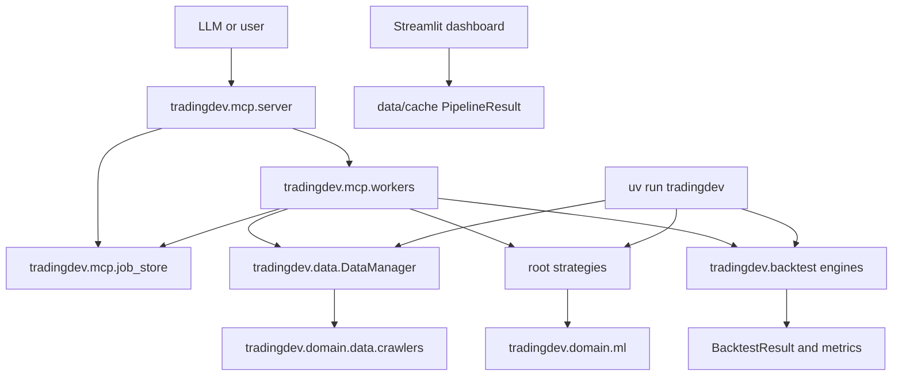
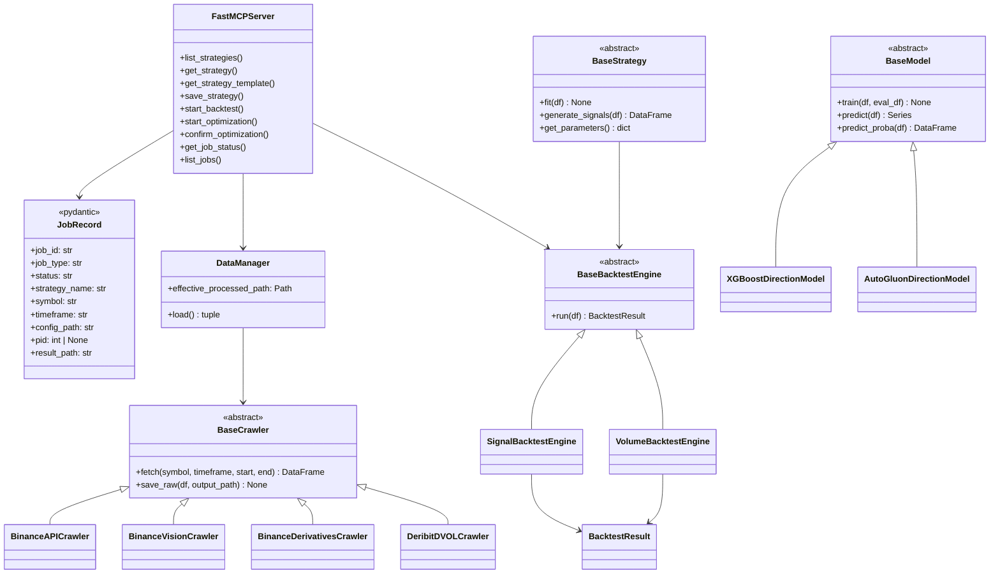

# Architecture Overview

TradingDev is being refactored into an MCP-first quantitative strategy
development server. MCP tools are the main product API. CLI and dashboard
entry points are adapters over the same package, not separate products.

Checkpoint 1 establishes the package boundary:

```text
src/tradingdev/
  mcp/
    server.py
    job_store.py
    workers/
      backtest.py
      optimization.py
  data/
    data_manager.py
    loader.py
    processor.py
    schemas.py
  domain/
    data/crawlers/
    ml/
      base.py
      models/
      features/
      thesis_validator.py
  backtest/
  dashboard/
  indicators/
  strategies/
  validation/
  utils/
```

Root-level `strategies/`, `configs/`, `data/`, and `.backtest_jobs/` are
temporary runtime locations kept for Checkpoint 1 compatibility. Later
checkpoints will move generated artifacts and runtime state under
`workspace/`, split bundled strategy configs from generated configs, and
replace `.backtest_jobs/jobs.json` with SQLite job/run/artifact metadata.

## Package Flow



## Runtime Entrypoints

- MCP stdio: `uv run tradingdev-mcp`
- MCP HTTP: `uv run tradingdev-mcp --web --transport streamable-http --port 8000`
- CLI backtest: `uv run python -m tradingdev.main --config configs/<strategy>.yaml`
- Module MCP launch: `uv run python -m tradingdev.mcp.server`

The MCP server launches background workers with module execution:

```text
python -m tradingdev.mcp.workers.backtest <job_id> <config_path>
python -m tradingdev.mcp.workers.optimization <job_id>
```

The server no longer mutates `sys.path` to import package code. Project-root
runtime paths are resolved from `TRADINGDEV_PROJECT_ROOT` when set, otherwise
from the current working directory.

## Current Domain Components



## Checkpoint Notes

- `tradingdev.domain.data.crawlers` owns external data crawlers.
- `tradingdev.domain.ml.models` owns model wrappers.
- `tradingdev.domain.ml.features` owns feature engineering.
- `tradingdev.mcp.job_store.JobRecord` gives the temporary JSON job store a
  typed schema while keeping filesystem storage until the SQLite checkpoint.
- `src/tradingdev/data/schemas.py` is still an aggregate schema module. Schema
  split happens in the next checkpoint.
- Root-level `strategies/registry.py` is still used by the CLI path. Unified
  strategy loading and workspace-generated strategies happen in the next
  checkpoint.
