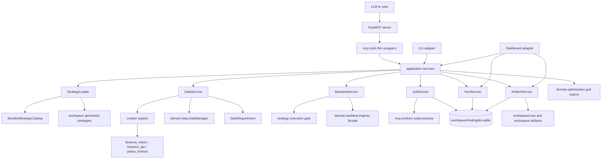
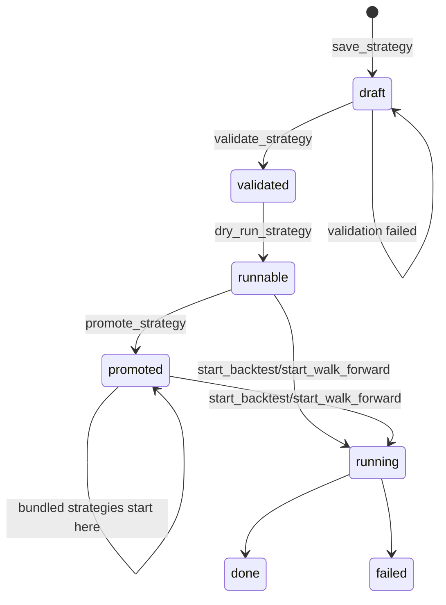
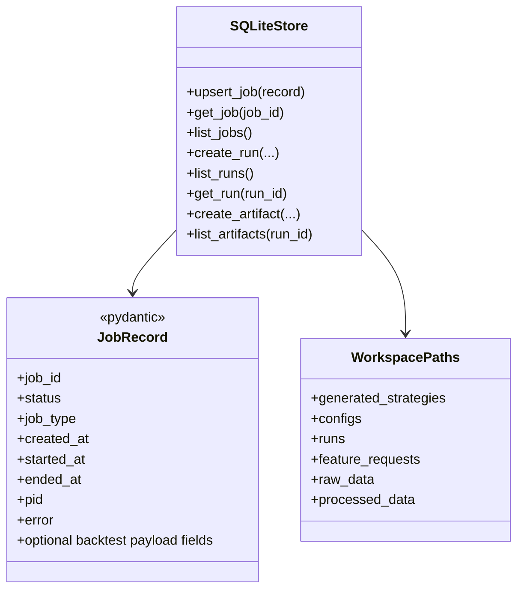

# Architecture Overview

TradingDev 的主要產品邊界是 MCP tools。MCP、CLI 與 dashboard 不各自組回測流程，
而是呼叫 `tradingdev.app` services；domain 層保存交易、資料、策略與模型邏輯；
adapters 層負責 FastMCP、CLI、dashboard、SQLite、filesystem 與 subprocess。

`mcp.server.create_server(workspace)` 統一組裝共用 workspace 與 SQLite store
的 services。匯入 server 模組不建立 runtime 檔案；啟動時可使用 `--workspace`
或 `TRADINGDEV_WORKSPACE`。背景 worker 與品質檢查使用 server 的 Python
interpreter；worker 明確繼承解析後的工作區與資料目錄。

Repository 與生成策略的 Ruff／strict Mypy 規則都來自 `pyproject.toml`。
Wheel 將同一份設定收錄為 `tradingdev/_quality/pyproject.toml`；驗證程序指定
該設定，不使用呼叫端工作目錄的設定。Ruff、Mypy 與所需 stubs 隨 runtime
安裝。生成策略另外使用 `follow-imports=silent`，保留依賴型別分析並只回報
策略本身的錯誤。

## Module Layout

```text
src/tradingdev/
  mcp/
    server.py
    prompts.py
    schemas.py
    tools/
    workers/
  app/
    strategy_service.py
    data_service.py
    backtest_service.py
    optimization_service.py
    job_service.py
    job_config.py
    run_service.py
    artifact_service.py
    feature_request_service.py
    capability_service.py
    contracts/
    job_store.py
    run_lineage.py
  domain/
    execution.py
    strategies/
    backtest/
    data/
    indicators/
    ml/
    optimization/
    validation/
  adapters/
    cli/
    dashboard/
    execution/
    storage/
  shared/
    utils/
```

## Runtime Flow


```mermaid
flowchart TB
    user[LLM or user] --> mcp[FastMCP server]
    mcp --> tools[mcp.tools thin wrappers]
    tools --> app[application services]
    cli[CLI adapter] --> app
    dashboard[Dashboard adapter] --> app

    app --> loader[StrategyLoader]
    app --> data[DataService]
    app --> backtest[BacktestService]
    app --> jobs[JobService]
    app --> runs[RunService]
    app --> artifacts[ArtifactService]

    loader --> catalog[BundledStrategyCatalog]
    loader --> generated[workspace generated strategies]
    data --> registry[crawler registry]
    registry --> crawlers[binance_vision / binance_api / yahoo_finance]
    data --> manager[domain.data.DataManager]
    data --> requirements[DataRequirement]
    backtest --> gate[strategy execution gate]
    backtest --> engines[domain.backtest.engines facade]
    app --> optimization[domain.optimization grid search]
    jobs --> workers[mcp.workers subprocesses]
    jobs --> sqlite[(workspace/tradingdev.sqlite)]
    runs --> sqlite
    artifacts --> sqlite
    artifacts --> files[workspace/runs and workspace artifacts]
    dashboard --> runs
    dashboard --> artifacts
```

## Strategy Lifecycle


```mermaid
stateDiagram-v2
    [*] --> draft: save_strategy
    draft --> validated: validate_strategy
    draft --> draft: validation failed
    validated --> runnable: dry_run_strategy
    runnable --> promoted: promote_strategy
    promoted --> promoted: bundled strategies start here
    runnable --> running: start_backtest/start_walk_forward
    promoted --> running: start_backtest/start_walk_forward
    running --> done
    running --> failed
```

Generated source and base config are immutable revisions under
`workspace/generated_strategies/<id>/revisions/<revision_id>/`. Each save writes
`strategy.py`, `config.yaml`, and `metadata.json`, then updates the strategy's
`current.json` pointer. Revision identity is a fresh UUID for every save, even
when source and config are unchanged. The lifecycle diagram applies to each
revision separately; saving B does not reset or inherit A's evidence.
`StrategyService` persists generated strategy metadata as typed
`StrategyMetadata` / `ValidationResult` models and owns every lifecycle
transition, including `promote`. Validation records contain their revision ID,
and checks write evidence back to the revision selected before execution.
`validate_strategy` and `dry_run_strategy`
share one `SignalContractChecker` (`domain/strategies/contract.py`) run at two
fixture depths. Bundled strategies live next to their git-versioned configs and
parameter config models under
`src/tradingdev/domain/strategies/bundled/<strategy>/` and are discovered
through `BundledStrategyCatalog`.

Execution is gated in the application layer: `BacktestService.prepare_execution`
resolves the strategy through `StrategyService.resolve_executable`, which
rejects anything that is not runnable or promoted, requires successful validation
and dry-run evidence for the same revision, checks source/base-config integrity,
and verifies that the effective config's source identity matches that revision.
`JobService` and `OptimizationService` use the same gate, and subprocess workers
recheck strategy eligibility before executing the manifest. An optional
`revision_id` selects an older revision explicitly; otherwise current is resolved
once before submission.
Job payloads and effective configs carry the selected revision through workers,
optimization confirmation and result persistence. Bundled strategies remain
Git-managed and have no generated revision identity (`revision_id: null`).

The revision binds source and base config. Execution may override request
dates/market inputs; generated backtest and walk-forward parameters must match
the base revision. Optimization may vary its search parameters while retaining
other base parameters. Legacy flat generated files are left untouched and require
resaving and validation before execution; no compatibility execution path
trusts their previous lifecycle status. Discovery lists legacy filenames as typed
`legacy` entries requiring a revision, independently of current revision loading.
The source query can read their fixed source/config locations for explicit
resaving, without trusting legacy metadata paths or validation evidence.

`app/job_config.py` applies request overrides and binds source identity
for both backtest and optimization jobs. Optimization trials and parallel search
share `StrategyLoader.create_from_execution`, retaining fixed effective parameters while
overriding the searched parameters.

## Execution Specifications

`domain/execution.py` defines the versioned `ExecutionManifest` and
`OptimizationSpec`. Before submission, `BacktestService.prepare_execution`
binds the selected strategy ID, generated revision when present, and source hash;
resolves data directories and feature paths to absolute paths; and fills typed
backtest, walk-forward, parallel, and optional seed defaults. The saved strategy
mapping remains subject to the revision contract. Dates become JSON strings and
all execution values must be finite JSON; non-finite requests are rejected.

Schema version 2 records the execution kind, resolved config, required effective
strategy constructor settings (`strategy_execution`), optional
optimization spec, and `manifest_hash`. The SHA-256 covers canonical JSON with
sorted object keys and excludes the hash field itself, job IDs and creation
timestamps. Omitted typed execution defaults and their explicit equivalents have
the same hash. The original strategy mapping stays revision-bound, while
`StrategyLoader.resolve_execution` captures declared constructor defaults and
recursively expanded bundled parameter/fit models in a separate object. The
worker constructs strategies from these saved values. Missing new constructor or
model fields, non-finite/non-JSON defaults, and normalization that changes the
saved values are rejected instead of silently accepting new defaults. Strategy
models permit lossless integer-to-float conversion for existing numeric fields,
so JSON grid candidates such as `80` remain valid for float settings.
Optimization fixes the parameter grid, metric, ordered non-overlapping calendar
date ranges, `maximize` direction, and trial/confirmation timeouts and polling
interval. Parameter names are sorted for traversal; each candidate list retains
its order. Optimization rejects a config with walk-forward validation settings
because its own training/test ranges define the split.
Nested optimization values recursively override the fixed base settings; fields
outside the search remain fixed. Parameter combinations are checked before a
job is created, without instantiating a strategy for each candidate.

Creation resolves defaults; decoding an existing manifest preserves its recorded
JSON values. Execution separately checks that current runtime models can consume
those values without adding defaults or changing their values, with only the
lossless strategy-model numeric conversion described above permitted.
Schema 1 manifests, missing version/effective strategy fields, and unknown versions
cannot execute through schema 2. Stored results remain readable. Future format
or decoding changes require a new schema version, not reinterpretation of saved
specifications using current defaults.

`ExecutionManifestStore` publishes `runs/<id>/manifest.json` atomically without
replacing an existing specification. `JobStore` keeps its expected digest in the
job record. File publication and the database write are separate operations, not
a cross-resource transaction. Workers receive only the job ID, load the fixed path,
and verify both
the content digest and job identity before executing. Confirmation and result
persistence also verify that binding. Changing an original config, a later
current revision, or the `config.yaml` inspection projection cannot redefine the
job. Legacy jobs without manifests cannot resume through these workers or be
confirmed; their saved results remain readable.

The model is frozen only at the field-assignment level. Consumers call
`verify()` to detect nested mutation and use `config_copy()` for independent
working config values. The digest is an integrity check against the separately
stored job identity, not a security boundary against writers controlling both
SQLite and the filesystem. The manifest freezes the requested execution; it
does not snapshot data contents, installed dependencies, the engine environment,
or RNG state and does not promise fully reproducible results.

## Storage


```mermaid
classDiagram
    class SQLiteStore {
        +upsert_job(record)
        +get_job(job_id)
        +list_jobs()
        +create_run(...)
        +list_runs()
        +get_run(run_id)
        +create_artifact(...)
        +list_artifacts(run_id)
    }

    class WorkspacePaths {
        +generated_strategies
        +configs
        +runs
        +feature_requests
        +raw_data
        +processed_data
    }

    class JobRecord {
        <<pydantic>>
        +job_id
        +status
        +job_type
        +created_at
        +started_at
        +ended_at
        +pid
        +error
        +optional backtest payload fields
    }

    SQLiteStore --> JobRecord
    SQLiteStore --> WorkspacePaths
```

SQLite stores metadata. The `jobs` table keeps generic job lifecycle columns;
backtest-specific values such as strategy, symbol, timeframe, date range, and
config path and manifest hash are payload fields. Filesystem stores generated code/config,
feature requests, data caches, and run artifacts. Each completed background job records
result, execution manifest, config snapshot, strategy source hash, random seed, optional strategy
source snapshot, dataset fingerprint, and dashboard `pipeline_result` artifacts
under `workspace/runs/<run_id>/`; that directory is linked from the
`runs.artifact_dir` column. `JobStore` publishes the manifest before starting a
worker and writes its resolved config as a YAML inspection projection.
`app.run_lineage` centralizes config/source/seed
lineage extraction for job and artifact services. CLI pipeline-result cache
files are stored under `workspace/data/processed/cache` (or
`$TRADINGDEV_DATA_ROOT/processed/cache`) and tracked through `ArtifactService`;
their run artifact directory is `workspace/runs/cli_<cache_key>/`, which holds
the manifest even though the pickle remains in the cache directory.
Job and CLI run config hashes describe the serialized executed config snapshot.
The separate manifest hash identifies the complete request, including any
optimization search settings. `compute_cache_key` requires the executed
`manifest_hash` and processed-data path explicitly; it has no YAML-based fallback.
Editing the original YAML after execution does not prevent saving the old
snapshot. Cache identity also includes processed-data file size/mtime and a Git
code fingerprint; those are invalidation signals, not immutable data or environment
versions. Completed pipeline results are retrieved by run ID through the recorded
artifact path, without recomputing a lookup key from current YAML, data, or code.
The unused YAML-based `load_cached_result` and `save_cached_result` APIs have been
removed; this artifact storage flow does not provide automatic reuse of prior
backtests. Background jobs persist their
verified in-memory manifest config at completion.
The dashboard reads run metadata and pipeline artifacts through `RunService` /
`ArtifactService`.

## MCP Response Contracts

`app/contracts` owns transport-independent Pydantic response DTOs. MCP adapters
validate service payloads against those DTOs before exposing them, and FastMCP
derives the advertised output schemas from the tool return annotations. Fixed
response objects reject undeclared fields; extensible metrics, parameters,
artifact metadata and unvalidated draft data requirements use explicit JSON
values. Discovery must remain usable while a draft's configuration is incomplete.
Internal service dictionaries and
persisted workspace records are not replaced by this boundary change.

Single model outputs are JSON objects; lists and success/failure unions use the
SDK's `result` wrapper. Expected application failures have stable codes, while
strategy validation retains its structured diagnostics. Invalid MCP arguments,
unexpected exceptions and response-contract violations use MCP error results.
Tool annotations describe actual side effects, including status reconciliation
and cache replacement. A false destructive hint promises only additive updates,
so tools that replace lifecycle state or validation evidence use a true hint.
These annotations are not authorization or sandbox guarantees.

Successful start responses require `manifest_hash`. Job status, job lists, and
run records expose it as nullable so historical records remain readable.
Completed results register an `execution_manifest` artifact for inspection
through the existing artifact tools. An invalid or absent manifest at
optimization confirmation returns `execution_manifest_invalid`.

Real stdio MCP tests validate structured responses against the schemas advertised
by the running server, including unsuccessful application outcomes. Separate
model workflows exercise strategy generation, repair, legacy source recovery,
backtesting and lookup.

## Domain Contracts

- Strategy signal convention: `1` long, `-1` short, `0` flat.
- Named technical indicators (SMA, EMA, RSI, MACD, Bollinger Bands, ATR, ADX,
  Stochastic) come from `domain/indicators`, the only module under `src/`
  that calls the official TA-Lib Python wrapper. It maps TA-Lib's tuple outputs
  to named results while preserving pandas indexes and native warm-up and NaN
  propagation. Bollinger Bands use population standard deviation; multi-series
  inputs require identical lengths and indexes, and infinite inputs are
  rejected. Strategies keep signals flat until all required indicator values
  are finite, without backfilling from future data. Statistical features such
  as realized volatility, Parkinson volatility, and return moments stay in
  pandas/numpy inside `domain/ml/features`. Generated strategies in a user
  workspace may also import `talib` directly; the strategy contract describes
  its Function API tuple order and requires the same warm-up and NaN handling.
  Static validation accepts `talib`, rejects the removed `pandas_ta` import,
  and does not enforce those numerical rules.
- Strategy parameters live in YAML `strategy.parameters`.
- Data requirements live in YAML `data.requirements`.
- `data.requirements.market.source` selects the market data crawler from the
  registry in `domain/data/crawlers/registry.py`: `"binance_vision"` (default,
  crypto via data.binance.vision; no geo-restriction), `"binance_api"` (crypto
  via ccxt), or `"yahoo_finance"` (stocks/ETFs/futures/indices/FX via the
  public Yahoo chart API, Yahoo symbol conventions). When omitted it inherits
  legacy `data.source`. New sources register a `BaseCrawler` factory; no
  strategy-layer or pipeline change is required.
- `data.market_type` selects the Binance Vision market segment: `"futures/um"`
  (default, USD-M perpetuals) or `"spot"`.
- `DataManager` consumes a `MarketDataRequest` (symbol/timeframe/date range)
  and an injected crawler; `domain.data` no longer depends on
  `domain.backtest`. Yearly cache file names come from
  `market_data_filename()`.
- `inspect_dataset(config_path)` reports market cache availability and feature
  source missing-value status from the same data root used by backtests.
- Start tools fix a per-job manifest under `workspace/runs/<job_id>/manifest.json`;
  MCP inputs override symbol, timeframe, and date range before its creation.
  Workers use the verified manifest; the adjacent `config.yaml` projects its
  resolved configuration for inspection.
- Generated strategies must pass static policy checks before execution.
  `validate_strategy` and `dry_run_strategy` currently execute generated Python
  code during contract checks; sandbox isolation is future work.
- A detached supervisor owns each background worker's separate process group.
  Startup captures the supervisor identity before allowing it to spawn a worker;
  startup failures persist a failed job and its error. Job status checks use the
  supervisor PID and creation time, including while awaiting confirmation.
- `cancel_job` and integration-test teardown request cleanup through a unique
  launch control directory, never by signalling a persisted numeric PID.
  The supervisor observes exit with POSIX `waitid(WNOWAIT)` and keeps its direct
  child unreaped until group termination and verification finish. This prevents
  PID/group reuse between an identity check and `killpg`, and also cleans joblib
  descendants after the worker leader exits normally or fails.
- Cancellation marks a job `cancelled` only after cleanup acknowledgement;
  missing control identity, timeout or cleanup failure returns an error.
  Supervisors require POSIX process groups and `waitid(WNOWAIT)`. External
  `SIGKILL` of the supervisor or descendants deliberately creating another
  session are outside this cleanup guarantee; this is not a sandbox.
- Runtime cache defaults to `workspace/data/`; `TRADINGDEV_DATA_ROOT` can override
  raw/processed data root.
