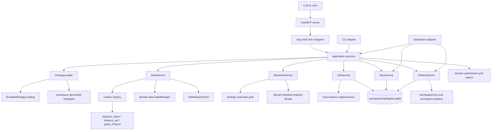
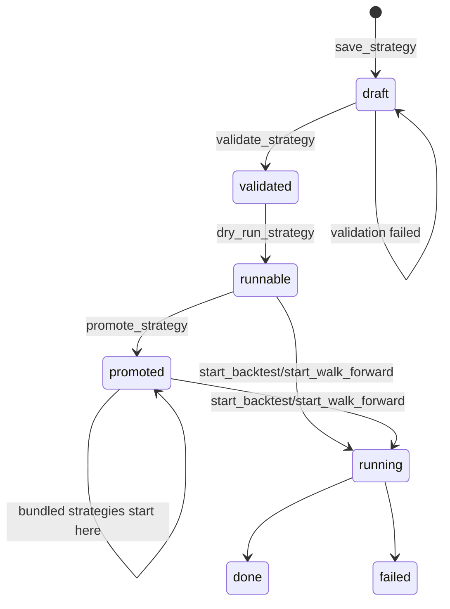
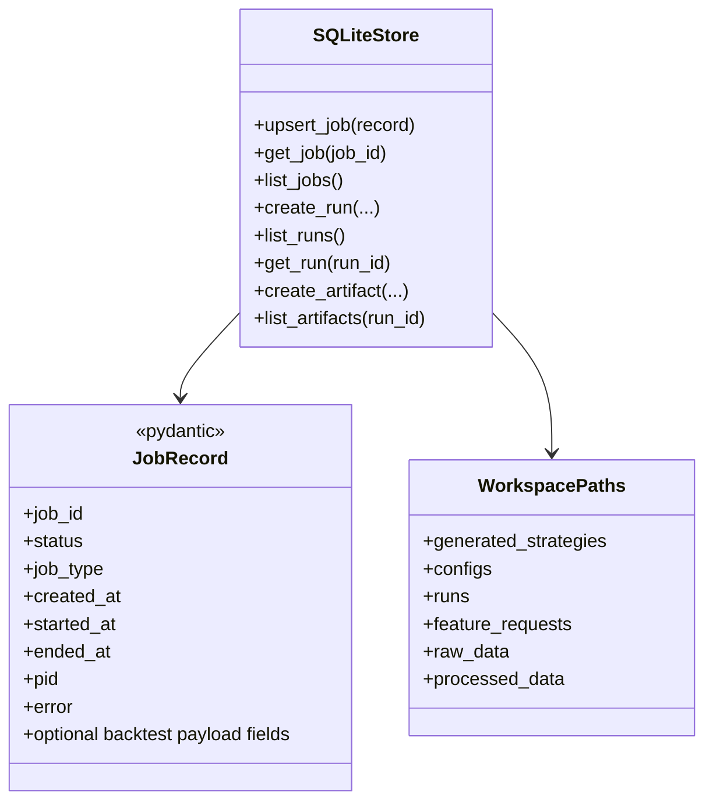

# Architecture Overview

TradingDev 的主要產品邊界是 MCP tools。MCP、CLI 與 dashboard 不各自組回測流程，
而是呼叫 `tradingdev.app` services；domain 層保存交易、資料、策略與模型邏輯；
adapters 層負責 FastMCP、CLI、dashboard、SQLite、filesystem 與 subprocess。

`mcp.server.create_server(workspace)` 統一組裝共用 workspace 與 SQLite store
的 services。匯入 server 模組不建立 runtime 檔案；啟動時可使用 `--workspace`
或 `TRADINGDEV_WORKSPACE`。背景 worker 與品質檢查使用 server 的 Python
interpreter；worker 明確繼承解析後的工作區與資料目錄。

Repository 與生成策略的 Ruff／strict Mypy 規則都來自 `pyproject.toml`。
Wheel 將同一份設定收錄為 `tradingdev/_quality/pyproject.toml`；驗證程序指定
該設定，不使用呼叫端工作目錄的設定。Ruff、Mypy 與所需 stubs 隨 runtime
安裝。生成策略另外使用 `follow-imports=silent`，保留依賴型別分析並只回報
策略本身的錯誤。

## Module Layout

```text
src/tradingdev/
  mcp/
    server.py
    prompts.py
    schemas.py
    tools/
    workers/
  app/
    strategy_service.py
    data_service.py
    backtest_service.py
    optimization_service.py
    job_service.py
    job_config.py
    run_service.py
    artifact_service.py
    feature_request_service.py
    capability_service.py
    job_store.py
    run_lineage.py
  domain/
    strategies/
    backtest/
    data/
    indicators/
    ml/
    optimization/
    validation/
  adapters/
    cli/
    dashboard/
    execution/
    storage/
  shared/
    utils/
```

## Runtime Flow


```mermaid
flowchart TB
    user[LLM or user] --> mcp[FastMCP server]
    mcp --> tools[mcp.tools thin wrappers]
    tools --> app[application services]
    cli[CLI adapter] --> app
    dashboard[Dashboard adapter] --> app

    app --> loader[StrategyLoader]
    app --> data[DataService]
    app --> backtest[BacktestService]
    app --> jobs[JobService]
    app --> runs[RunService]
    app --> artifacts[ArtifactService]

    loader --> catalog[BundledStrategyCatalog]
    loader --> generated[workspace generated strategies]
    data --> registry[crawler registry]
    registry --> crawlers[binance_vision / binance_api / yahoo_finance]
    data --> manager[domain.data.DataManager]
    data --> requirements[DataRequirement]
    backtest --> gate[strategy execution gate]
    backtest --> engines[domain.backtest.engines facade]
    app --> optimization[domain.optimization grid search]
    jobs --> workers[mcp.workers subprocesses]
    jobs --> sqlite[(workspace/tradingdev.sqlite)]
    runs --> sqlite
    artifacts --> sqlite
    artifacts --> files[workspace/runs and workspace artifacts]
    dashboard --> runs
    dashboard --> artifacts
```

## Strategy Lifecycle


```mermaid
stateDiagram-v2
    [*] --> draft: save_strategy
    draft --> validated: validate_strategy
    draft --> draft: validation failed
    validated --> runnable: dry_run_strategy
    runnable --> promoted: promote_strategy
    promoted --> promoted: bundled strategies start here
    runnable --> running: start_backtest/start_walk_forward
    promoted --> running: start_backtest/start_walk_forward
    running --> done
    running --> failed
```

Generated strategies must live in `workspace/generated_strategies/`.
`StrategyService` persists generated strategy metadata as typed
`StrategyMetadata` / `ValidationResult` models and owns every lifecycle
transition, including `promote`. `validate_strategy` and `dry_run_strategy`
share one `SignalContractChecker` (`domain/strategies/contract.py`) run at two
fixture depths. Bundled strategies live next to their git-versioned configs and
parameter config models under
`src/tradingdev/domain/strategies/bundled/<strategy>/` and are discovered
through `BundledStrategyCatalog`.

Execution is gated in the application layer: `BacktestService.run_raw_config`
resolves the strategy through `StrategyService.resolve_executable`, which
rejects anything that is not runnable or promoted and verifies that the
config's `source_path` matches the registered source. `JobService` and
`OptimizationService` use the same gate, so MCP jobs, the CLI, and subprocess
workers all pass through one check.

`app/job_config.py` applies request overrides and writes effective config snapshots
for both backtest and optimization jobs. Optimization trials and parallel search
share `StrategyLoader.create_from_config`, retaining fixed YAML parameters while
overriding the searched parameters.

## Storage


```mermaid
classDiagram
    class SQLiteStore {
        +upsert_job(record)
        +get_job(job_id)
        +list_jobs()
        +create_run(...)
        +list_runs()
        +get_run(run_id)
        +create_artifact(...)
        +list_artifacts(run_id)
    }

    class WorkspacePaths {
        +generated_strategies
        +configs
        +runs
        +feature_requests
        +raw_data
        +processed_data
    }

    class JobRecord {
        <<pydantic>>
        +job_id
        +status
        +job_type
        +created_at
        +started_at
        +ended_at
        +pid
        +error
        +optional backtest payload fields
    }

    SQLiteStore --> JobRecord
    SQLiteStore --> WorkspacePaths
```

SQLite stores metadata. The `jobs` table keeps generic job lifecycle columns;
backtest-specific values such as strategy, symbol, timeframe, date range, and
config path are optional payload fields. Filesystem stores generated code/config,
feature requests, data caches, and run artifacts. Each completed run records
result, config snapshot, strategy source hash, random seed, optional strategy
source snapshot, dataset fingerprint, and dashboard `pipeline_result` artifacts
under `workspace/runs/<run_id>/`; that directory is linked from the
`runs.artifact_dir` column. `app.job_config` applies request-level market/date
overrides and writes execution snapshots shared by `JobService` and
`OptimizationService`. `app.run_lineage` centralizes config/source/seed
lineage extraction for job and artifact services. CLI pipeline-result cache
files are stored under `workspace/data/processed/cache` (or
`$TRADINGDEV_DATA_ROOT/processed/cache`) and tracked through `ArtifactService`.
The dashboard reads run metadata and pipeline artifacts through `RunService` /
`ArtifactService`.

## Domain Contracts

- Strategy signal convention: `1` long, `-1` short, `0` flat.
- Strategy parameters live in YAML `strategy.parameters`.
- Data requirements live in YAML `data.requirements`.
- `data.requirements.market.source` selects the market data crawler from the
  registry in `domain/data/crawlers/registry.py`: `"binance_vision"` (default,
  crypto via data.binance.vision; no geo-restriction), `"binance_api"` (crypto
  via ccxt), or `"yahoo_finance"` (stocks/ETFs/futures/indices/FX via the
  public Yahoo chart API, Yahoo symbol conventions). When omitted it inherits
  legacy `data.source`. New sources register a `BaseCrawler` factory; no
  strategy-layer or pipeline change is required.
- `data.market_type` selects the Binance Vision market segment: `"futures/um"`
  (default, USD-M perpetuals) or `"spot"`.
- `DataManager` consumes a `MarketDataRequest` (symbol/timeframe/date range)
  and an injected crawler; `domain.data` no longer depends on
  `domain.backtest`. Yearly cache file names come from
  `market_data_filename()`.
- `inspect_dataset(config_path)` reports market cache availability and feature
  source missing-value status from the same data root used by backtests.
- `start_backtest` / `start_walk_forward` write a per-job effective config under
  `workspace/runs/<job_id>/config.yaml`; MCP tool inputs override the config's
  symbol, timeframe, and date range before the subprocess worker executes it.
- Generated strategies must pass static policy checks before execution.
  `validate_strategy` and `dry_run_strategy` currently execute generated Python
  code during contract checks; sandbox isolation is future work.
- A detached supervisor owns each background worker's separate process group.
  Startup captures the supervisor identity before allowing it to spawn a worker;
  startup failures persist a failed job and its error. Job status checks use the
  supervisor PID and creation time, including while awaiting confirmation.
- `cancel_job` and integration-test teardown request cleanup through a unique
  launch control directory, never by signalling a persisted numeric PID.
  The supervisor observes exit with POSIX `waitid(WNOWAIT)` and keeps its direct
  child unreaped until group termination and verification finish. This prevents
  PID/group reuse between an identity check and `killpg`, and also cleans joblib
  descendants after the worker leader exits normally or fails.
- Cancellation marks a job `cancelled` only after cleanup acknowledgement;
  missing control identity, timeout or cleanup failure returns an error.
  Supervisors require POSIX process groups and `waitid(WNOWAIT)`. External
  `SIGKILL` of the supervisor or descendants deliberately creating another
  session are outside this cleanup guarantee; this is not a sandbox.
- Runtime cache defaults to `workspace/data/`; `TRADINGDEV_DATA_ROOT` can override
  raw/processed data root.
