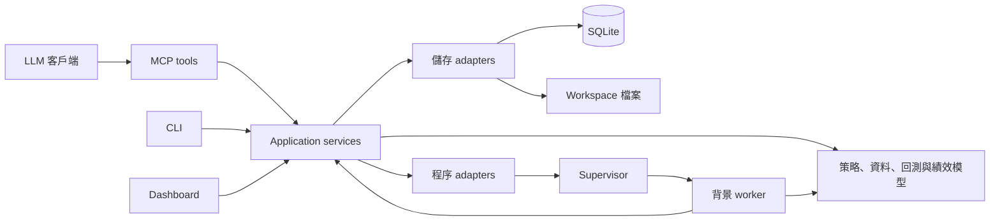
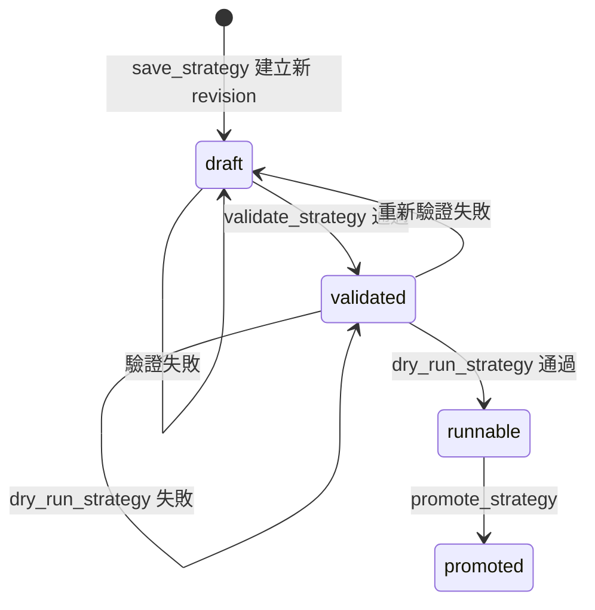
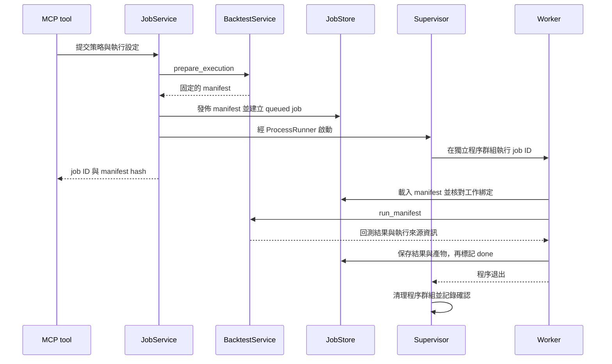
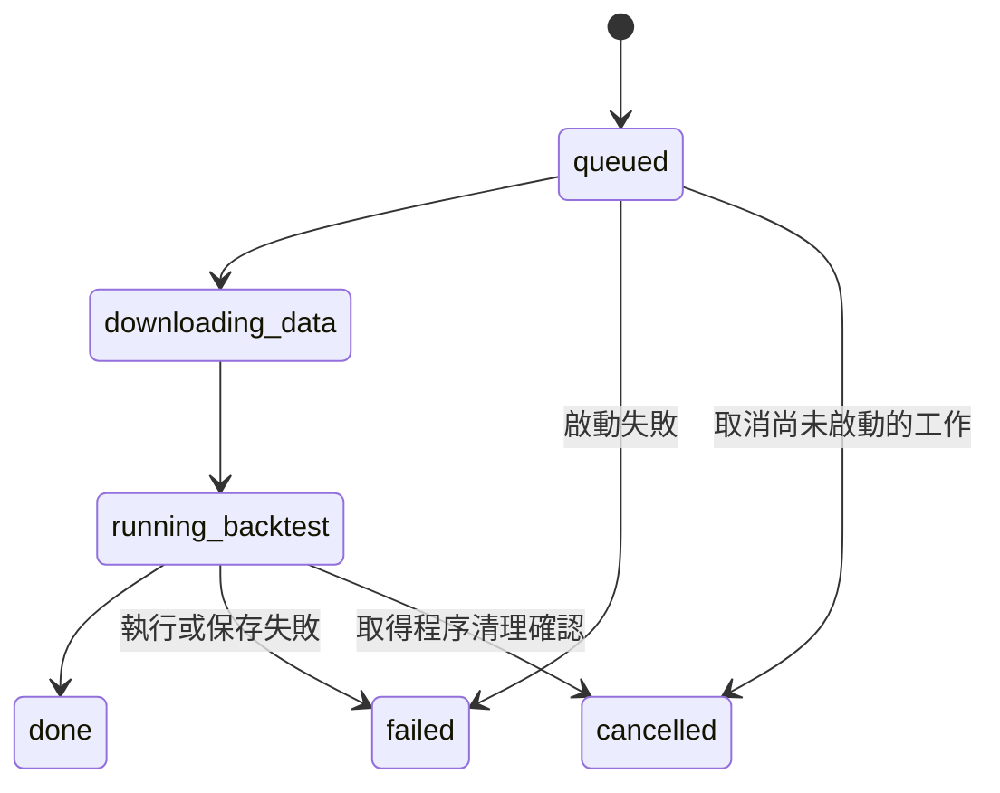

# 系統架構

TradingDev 讓 LLM 透過標準 MCP 協助使用者建立、驗證與研究交易策略，
提供歷史回測、參數最佳化及結果追蹤，不提供真實下單。
MCP 是主要產品介面；CLI 與 dashboard 共用 application services 的執行與查詢能力。
模型供應商的呼叫與設定留在客戶端整合層，後端不依賴特定 LLM。

本文件說明目前的責任分工、核心概念、執行流程及保證範圍。
操作與資料格式各有以下文件，避免在架構總覽重複維護欄位與版本清單。

| 文件 | 負責內容 |
| ---- | -------- |
| [README](README.md) | 安裝、設定、工具使用與使用者升級說明 |
| [策略契約](docs/strategy_contract.md) | 策略 Python／YAML、驗證規則、revision 與執行資格 |
| [執行產物契約](docs/run_artifacts.md) | Manifest、SQLite、檔案格式、指標範圍與查詢契約 |
| [開發指南](docs/development.md) | 開發環境、品質檢查、測試及 Git／PR 流程 |
| [代理開發政策](AGENTS.md) | 代理修改 repository 時遵循的政策 |

## 系統邊界與模組責任

以下是主要呼叫關係。Application services 協調策略、資料與執行；
MCP tools 負責協定轉換，CLI 負責同步執行入口，dashboard 負責已保存結果的呈現。

```mermaid
flowchart LR
    client[LLM 客戶端] --> mcp[MCP tools]
    mcp --> app[Application services]
    cli[CLI] --> app
    dashboard[Dashboard] --> app
    app --> domain[策略、資料、回測與績效模型]
    app --> storage[儲存 adapters]
    app --> process[程序 adapters]
    storage --> sqlite[(SQLite)]
    storage --> files[Workspace 檔案]
    process --> supervisor[Supervisor]
    supervisor --> worker[背景 worker]
    worker --> app
    worker --> domain
```

| 位置 | 目前責任 |
| ---- | -------- |
| `mcp/server.py`、`mcp/tools/` | 組裝 services、註冊工具、驗證協定輸入與輸出 |
| `mcp/workers/` | 背景工作入口、狀態更新及流程協調；最佳化 worker 直接協調搜尋與樣本外測試 |
| `app/` | 策略生命週期、設定固定、工作提交、結果保存與查詢；`contracts/` 定義回覆 DTO |
| `domain/strategies/` | 策略介面、來源探索與載入、參數解析、訊號契約及 bundled strategies |
| `domain/execution.py`、`domain/randomness.py` | 執行規格與完整性檢查、每次執行的亂數 context |
| `domain/backtest/`、`domain/validation/`、`domain/optimization/` | 回測引擎、walk-forward、參數搜尋與績效計算整合 |
| `domain/performance/` | 指標定義、適用條件、最佳化方向與具型別的績效產物模型 |
| `domain/data/`、`domain/indicators/`、`domain/ml/` | 行情與特徵資料處理、技術指標、模型及訓練邏輯 |
| `adapters/storage/`、`adapters/execution/` | SQLite、revision／manifest／績效檔案保存，以及程序啟動與監督 |
| `adapters/cli/`、`adapters/dashboard/` | 終端機與視覺化入口 |
| `shared/` | 路徑解析、JSON 正規化、記錄與平行執行等共用工具 |

這是目前實作的責任分組，尚未形成全面的依賴反轉。
Application services 直接使用具體的儲存與程序 adapters；`domain/data` 內的
crawlers、loader 與 DataManager 仍執行網路及檔案 I/O，StrategyLoader 也會
讀取、載入策略檔案。最佳化的完整流程仍由 worker 協調，尚未全部收斂到 app。
修改這些模組時，不能假設 domain 全部都是無副作用的純計算。

`mcp.server.create_server()` 是 MCP 的組裝入口，讓 services 共用 workspace
與 SQLite store。匯入 server 模組不建立 runtime 檔案；建立 server 時才組裝執行資源。
背景 worker 使用相同 Python interpreter，並明確繼承解析後的 workspace 與資料根目錄。
Bundled 策略隨 Git／套件發佈；生成策略、行情與執行結果存於使用者 workspace。

## 核心概念與身分

| 概念 | 意義與責任 |
| ---- | ---------- |
| Strategy revision | 一份生成策略的固定程式與基礎設定，由 StrategyService 管理狀態與驗證證據 |
| Execution manifest | 一次執行的固定請求，綁定策略身分、有效設定、建構子參數及可選的最佳化規格 |
| Job | 背景工作的進度、程序身分與控制紀錄，由 JobService／OptimizationService 提交，透過 JobStore 保存 |
| Run | 一次已保存的執行結果，記錄策略、設定與資料來源資訊，由 RunService 查詢 |
| Artifact | 與執行或研究相關的檔案及其索引，由 ArtifactService 提供探索與讀取 |

一個 revision 可以提交多次工作；工作開始或結束不會把策略狀態改成 running 或 done。
參數實驗屬於工作設定：MCP 的 `parameters` 覆寫與 CLI 執行設定共用
BacktestService，在同一 revision 上固定不同參數的 manifest，避免重複保存策略程式。
Generated 策略以固定的建構子設定執行短、長訊號契約檢查，驗證與 dry-run
的基礎證據仍保留在原 revision；實驗不會更新這些證據或 current pointer。
背景回測與最佳化完成時，目前以 job ID 作為 run ID。CLI 同步執行也會保存獨立 run，
但不建立背景 job。相同設定的兩次執行可以留下不同結果，不會因設定相同而覆寫前次 run。

Manifest 保留 revision 綁定的身分與非參數宣告，以及該次執行的參數。
未提供 MCP `parameters` 或傳入 `null` 時，`config.strategy.parameters` 保留
輸入設定的參數映射，建構子預設值另外展開至 `strategy_execution`；明確提供映射
（包括 `{}`）時，則將合併後、包含預設值的完整實驗參數寫入 `config.strategy.parameters`，
取代這份執行快照中的基礎參數宣告。CLI 使用其執行 YAML 的參數映射。
原 revision 的 YAML 與證據均不改寫；worker 使用已固定的設定，不能因目前程式
新增預設值而重新解釋舊請求。完整格式與版本規則見
[Execution Manifest](docs/run_artifacts.md#execution-manifest)。

## 從策略建立到結果查詢

### 建立與驗證策略

每次 `save_strategy` 都建立新的 revision，即使程式與 YAML 相同也有新身分。
程式與基礎設定固定不變，metadata 則記錄該 revision 的狀態與驗證證據；
current pointer 指向最新保存的 revision。保存新版本不會撤銷舊版本的證據，
也不會讓新版本繼承舊版本的執行資格。

`StrategyCleanupService` 提供舊草稿的預覽與明確指定版本清理。儲存 adapter
檢查所有 job、run 與遺留 manifest 的引用；身分不明或資料損壞時停止清理。
current、非 draft 及被引用版本均保留。保存、驗證、狀態更新與清理共用每個策略的
lifecycle lock，避免檢查與刪除交錯；鎖檔位於 revision 目錄之外且不刪除。
清理每次重新確認資格與檔案完整性，檔案刪除不具跨版本或目錄內的交易原子性。

```mermaid
stateDiagram-v2
    [*] --> draft: save_strategy 建立新 revision
    draft --> draft: 驗證失敗
    draft --> validated: validate_strategy 通過
    validated --> draft: 重新驗證失敗
    validated --> validated: dry_run_strategy 失敗
    validated --> runnable: dry_run_strategy 通過
    runnable --> promoted: promote_strategy
```

上圖描述成功保存後的生成策略 revision。保存被拒絕時不會建立 revision；
bundled 策略由 Git 管理並以 promoted 身分提供，沒有生成策略的 revision ID。
舊的平面生成策略檔案可供讀取與重新保存，其舊狀態不能授權執行。

`StrategyService` 先做靜態政策及共用品質檢查，再透過 `SignalContractChecker`
檢查完整執行設定與訊號契約。驗證與 dry-run 共用 checker，使用不同長度的測試資料。
固定設定欄位拒絕未知名稱；策略參數保留明確的動態結構。成功解析的設定會以
`effective_config` 回傳，供 LLM 在提交前核對，資料目錄預設值則在提交時解析。
Repository 與生成策略共用 `pyproject.toml` 的 Ruff／strict Mypy 政策，
安裝後也使用隨 wheel 收錄的同一份設定。

所有驗證證據都綁定所選 revision。`BacktestService.prepare_execution()` 經由
`StrategyService.resolve_executable()` 檢查狀態、驗證證據與程式／基礎設定完整性；
worker 執行時再次檢查資格。指定 revision 不存在時不會退回 current，
省略 revision 時則在該操作開始時選定 current。詳細狀態與覆寫規則見
[策略生命週期](docs/strategy_contract.md#lifecycle)。

### 提交與執行回測

一般回測與 walk-forward 共用 BacktestService、JobStore 與背景回測 worker。
提交先套用交易對、期間等請求設定，再解析資料位置與策略建構子參數，形成 manifest。
設定無效時回傳結構化錯誤；工作建立後若程序啟動失敗，則保存 failed 紀錄並回報例外。

```mermaid
sequenceDiagram
    participant MCP as MCP tool
    participant Submit as JobService
    participant Execute as BacktestService
    participant Store as JobStore
    participant Supervisor
    participant Worker
    MCP->>Submit: 提交策略與執行設定
    Submit->>Execute: prepare_execution
    Execute-->>Submit: 固定的 manifest
    Submit->>Store: 發佈 manifest 並建立 queued job
    Submit->>Supervisor: 經 ProcessRunner 啟動
    Supervisor->>Worker: 在獨立程序群組執行 job ID
    Submit-->>MCP: job ID 與 manifest hash
    Worker->>Store: 載入 manifest 並核對工作綁定
    Worker->>Execute: run_manifest
    Execute-->>Worker: 回測結果與執行來源資訊
    Worker->>Store: 保存結果與產物，再標記 done
    Worker-->>Supervisor: 程序退出
    Supervisor->>Supervisor: 清理程序群組並記錄確認
```

背景回測 job 的正常狀態序列如下，與前面的策略狀態獨立。

```mermaid
stateDiagram-v2
    [*] --> queued
    queued --> downloading_data
    downloading_data --> running_backtest
    running_backtest --> done
    queued --> failed: 啟動失敗
    running_backtest --> failed: 執行或保存失敗
    queued --> cancelled: 取消尚未啟動的工作
    running_backtest --> cancelled: 取得程序清理確認
```

圖中顯示主要路徑；其他非終止階段也可能失敗或被取消，狀態查詢還會核對程序身分，
將已失聯的工作記為失敗。目前 worker 在呼叫 `run_manifest()` 前就標記
running_backtest，因此狀態名稱不能作為資料下載已完成的證明。
done 表示結果保存成功；程序清理由 supervisor 在 worker 退出後完成，兩者各有證據。

`DataService` 依資料需求選擇 crawler、取得行情快取並合併特徵資料，供策略產生訊號。
`create_backtest_engine()` 依模式建立引擎：signal 模式使用 VectorBT portfolio，
volume 模式使用專案的逐筆模擬與帳本。Walk-forward 由 WalkForwardValidator
依序執行各 fold 的訓練與評估。專案內的技術指標集中於 TA-Lib facade，模型與統計特徵位於
`domain/ml`；訊號、暖機期及資料使用規則由策略契約定義。

CLI 直接同步呼叫 BacktestService，再交 ArtifactService 保存結果；
它共用策略資格檢查、manifest 與績效模型，但不經 supervisor 或背景 job 狀態流程。

### 最佳化的試跑與確認

OptimizationService 在提交前固定搜尋參數、訓練／測試期間、指標方向與等待政策，
並檢查候選參數結構。搜尋之外的有效設定保持固定。最佳化使用自己的訓練／測試切分，
不能同時套用 walk-forward 設定；候選檢查也不代表所有策略建構與執行一定成功。

最佳化 worker 載入資料後，以第一組參數試跑估時，在記憶體保留試跑結果並進入
pending_confirmation。使用者同意後，確認工具核對 job 與 manifest，
讓原 worker 繼續搜尋剩餘組合。它依 manifest 記錄的最大化或最小化方向選出參數，
再進行樣本外測試，保存各 trial 與選定參數的測試結果。

試跑逾時以 estimation_timeout 結束；等待確認逾時則標記 failed，不繼續完整搜尋。
不可計算的指標不參與排名，沒有可排名候選時工作失敗。
使用者操作範例見 [README](README.md#使用樣本外驗證與最佳化)。

### 保存與查詢結果

背景 worker 透過 JobStore 保存結果，CLI 透過 ArtifactService 保存；
兩條路徑共用 manifest 與績效儲存 adapters。SQLite 保存工作、run、artifact 索引與
數值指標；filesystem 保存 revision、資料快取及執行產物。

Backtest／walk-forward 另存 PipelineResult，供 dashboard 載入呈現；
optimization 保存完整 trial 與樣本外績效產物，不產生該 pickle。
CLI 的 pipeline pickle 位於資料快取目錄，manifest 與績效 JSON 則位於 run 目錄。
讀取既有結果使用保存的 artifact 路徑，不用目前 YAML 或資料重新推算查找鍵；
結果快取也不提供自動重用先前回測的行為。

RunService 提供 run 與指標查詢，ArtifactService 提供檔案探索與讀取。
Dashboard 透過這兩個 services 取得已保存結果。檔案清單、資料表與保存位置見
[執行產物契約](docs/run_artifacts.md)。

## 績效計算與對話摘要

績效處理分成計算、保存與呈現三個責任。摘要欄位只控制回覆大小，不決定後端留下哪些指標。

| 元件 | 責任 |
| ---- | ---- |
| `domain/backtest/metrics.py` | 統一時間、淨值與交易紀錄，整合第三方統計，記錄計算設定與不可用原因 |
| `empyrical-reloaded` | 報酬與風險統計；Python 匯入名稱為 `empyrical` |
| `vectorbt` | 兩種引擎的已平倉交易統計；signal 引擎另使用其 portfolio 模擬 |
| `domain/performance/catalog.py` | 指標 ID、定義、單位、適用模式、摘要選擇及最佳化方向 |
| `domain/performance/sampling.py` | 日級觀測需求與 K 棒頻率判斷，供績效計算及最佳化提交共用 |
| `domain/performance/artifacts.py` | 各結果範圍的績效與原始觀察值模型，保存當次定義與計算來源 |
| `adapters/storage/performance.py` | 發佈與驗證績效 JSON、觀察值 JSON 及其儲存身分 |
| `RunService`／`JobService` | 提供一般摘要、指標探索資訊與所需的詳細查詢 |

專案負責成交、費用與滑價的記帳語意，以及引擎資料到統計套件的轉換。
年化採觀察到的 UTC 日報酬與明確指定的年化頻率，不從 K 棒頻率猜測交易日數。
日級指標只接受宣告為日線或更細的資料，不用日期缺口推斷 K 棒頻率。
粗於日頻或無法辨識的頻率，年化、日回撤與日／月損益指標保留為不可用；
仍保存逐根 K 棒的觀察值、總報酬、總損益與交易統計。最佳化提交共用此判斷，
在建立工作前拒絕不適用的目標。
Volume 模式沒有初始資金基準，不產生虛構的資金報酬率。
無法計算或不適用的數值保留原因，不以零代替。

完整指標連同套件版本、計算設定與定義快照一起保存。一般 run／job 回覆只挑摘要，
LLM 可先探索指標目錄與該 run 的可用範圍，再查詢未出現在摘要的指標。
詳細查詢驗證已保存的 JSON 產物，不載入 pickle 或重新執行策略。
目前目錄負責探索；歷史結果的解讀使用執行時保存的定義。

Walk-forward 保存每個 fold 的訓練／測試結果；其摘要是各 fold 的統計分布，
不是整段期間重新計算的報酬。最佳化分別保存各 trial 與選定參數的樣本外測試。
比較 run 時會指出定義、套件、設定、範圍與資金基準差異，避免直接排名不可比的結果。
具體 scope 與數值契約見 [績效範圍與來源](docs/run_artifacts.md#performance-scopes-and-provenance)。

## 一致性、程序管理與保證範圍

### 設定與儲存一致性

Generated 策略執行時必須維持 revision 綁定的策略身分與非參數宣告；一般執行可
調整 `strategy.parameters`，市場、期間與成本可在策略宣告之外覆寫。
最佳化只允許搜尋範圍內的參數變化。提交時固定有效預設值與
絕對資料路徑，worker 以 manifest 作為執行設定來源，也不追蹤稍後的 current pointer；
它仍會讀取所選 revision 的基礎設定，以檢查內容完整性與宣告一致性。
執行產物中的 `config.yaml` 是 manifest 的檢視副本，不是另一份可修改工作內容的設定。

Manifest 檔案以不可覆寫的方式原子發佈，SQLite job 紀錄保存預期摘要。
載入與保存結果時核對內容及 job 綁定，防止混用不同工作的規格。
檔案發佈與資料庫寫入仍是分開的操作，不構成跨資源交易。
Manifest 的 hash 用於完整性檢查，不能防禦同時控制資料庫與檔案的寫入者。

### MCP 回覆契約

MCP 使用 StrictFastMCP 拒絕未知頂層參數，避免拼錯名稱卻套用預設值；
`app/contracts` 的 DTO 再檢查 service 回覆，讓協定輸出可被工具 schema 驗證。
預期的應用失敗使用穩定 code 或診斷；參數錯誤、非預期例外與回覆契約錯誤則使用
MCP error。動態策略參數與指標映射有明確的 JSON 邊界，不受固定欄位白名單截斷。

每個工具提供 `outputSchema`。客戶端須依 `tools/list` 的 schema 讀取
`structuredContent`：單一物件回覆直接位於根層；清單與成功／失敗聯集回覆
放在 `structuredContent.result`。舊自訂客戶端若直接從根層讀取 `success`、
`job_id` 等欄位，須依目前 schema 調整；此回覆格式不會遷移或改寫工作區資料。

預期的操作失敗保留 `success: false` 或空 `job_id` 等工具語意，並提供穩定的
`code`；驗證失敗的 `diagnostics` 包含 `code`、`phase` 與 `fix`。
`get_job_status` 的 `status: not_found` 表示查無工作，`status: failed` 則表示
找到已失敗的工作。參數格式錯誤、未預期的例外或無效回覆使用 MCP
`isError: true`；客戶端不能只依 `isError` 判斷應用操作是否成功。

工具同時標註唯讀、破壞性、冪等及外部互動提示。這些標註描述實際副作用，
不提供授權或隔離保證。例如 `get_job_status` 可能更新失去 worker 的工作狀態，
`ensure_data` 可能下載資料並替換不完整快取；策略驗證與 dry-run 會執行生成 Python。
`destructiveHint: false` 表示不覆寫或刪除既有內容；會替換狀態或驗證證據的工具
也標示為 `true`，不只限於刪除檔案。

### 程序控制與清理

ProcessRunner 先核對 supervisor 身分，才允許建立 worker 的獨立程序群組。
Supervisor 負責正常退出、失敗與取消後的群組清理；控制請求使用唯一 launch 身分，
不直接向資料庫內的數字 PID 發送終止訊號。
執行中的 job 必須取得清理確認後才能標記 cancelled；證據缺失或清理失敗會回報錯誤。
尚未啟動程序的 queued job 可直接取消。

目前監督機制依賴 POSIX process groups 與 `waitid(WNOWAIT)`，
以尚未回收的直屬 child 維持程序身分，避免檢查與終止之間的 PID／群組重用。
外部強殺 supervisor、後代自行脫離 session，以及提交時在 server 內執行的策略模組
不在這項清理保證內。控制檔案與狀態證據見 [執行產物契約](docs/run_artifacts.md#workspace-layout)。

### 可重現性與策略執行安全

頂層 `random_seed` 是執行種子的唯一來源。每次驗證、dry-run、回測與最佳化評估
在建構策略前建立獨立的 Python／NumPy 亂數 context，結束或失敗時還原外層 context。
Walk-forward 依固定 fold 順序共用該次執行的亂數串流；平行 trial 各自建立 context。
策略透過 `domain.randomness` 取得產生器或種子，第三方模型的 seed 需明確傳入。
這不會覆寫全域亂數狀態，也不會控制任意第三方產生器。

Manifest 固定請求；來源 hash、資料指紋與套件版本提供追蹤依據。
它們不等於封存完整行情、Python 依賴與執行環境，因此不承諾跨環境完全重現。
無法依目前契約執行的舊 manifest 必須重新提交，既有結果可依保存內容讀取；
缺少績效來源產物時明確回報不可用，不猜測來源或自動重算。

策略驗證與 dry-run 會執行生成 Python。提交時會載入策略模組、解析建構子設定，
並在建立 job、啟動 worker 前，以 80 與 240 筆 fixture 建構生成策略、執行訊號檢查；
未提供參數覆寫的提交也會執行這些檢查。這些程式在呼叫端程序內執行，MCP 請求即
在 server 程序內，不受尚未啟動的 worker supervisor、試跑逾時或 job 取消管控。
最佳化提交另檢查候選參數結構；worker 評估生成策略候選時再以該組參數執行訊號契約檢查。
靜態政策檢查、workspace 路徑與背景程序監督都不是完整 sandbox；
實際安全模型見 [策略安全模型](docs/strategy_contract.md#security-model)。
